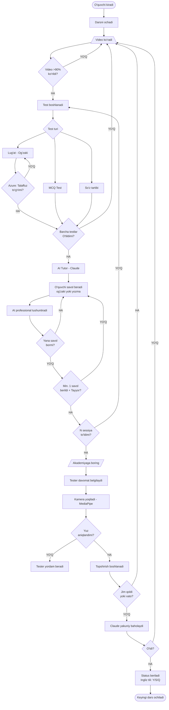
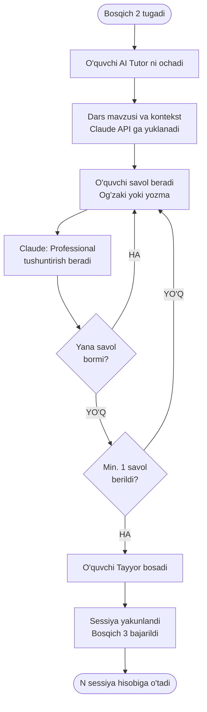
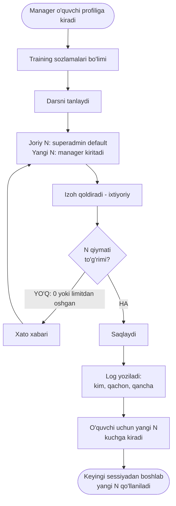
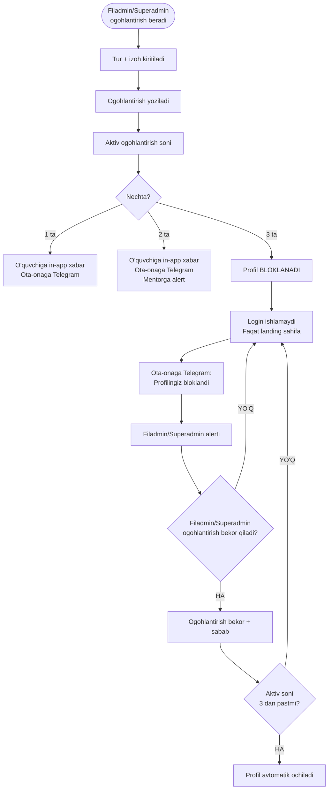
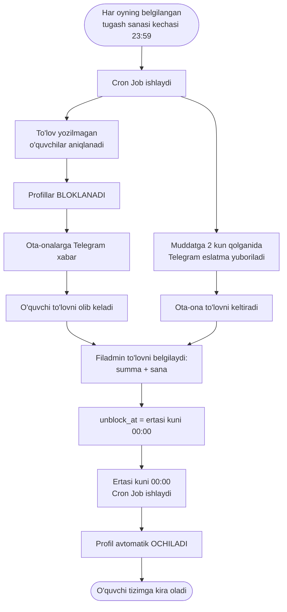
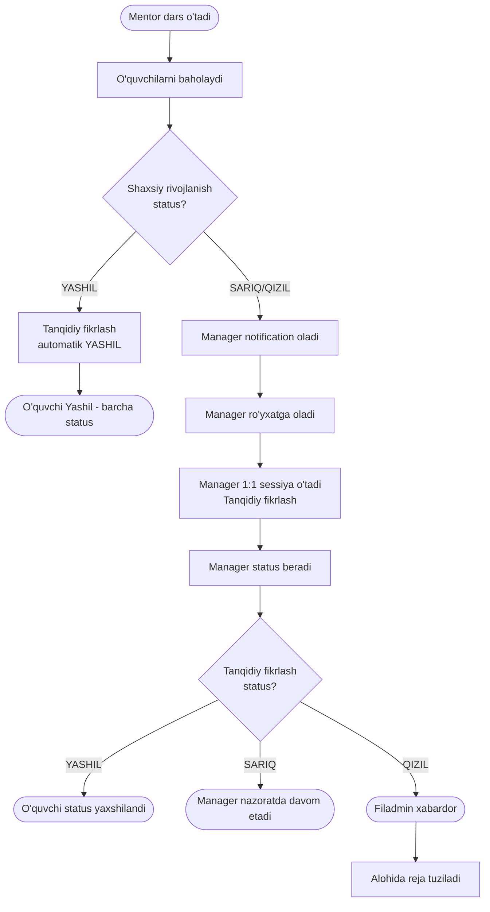
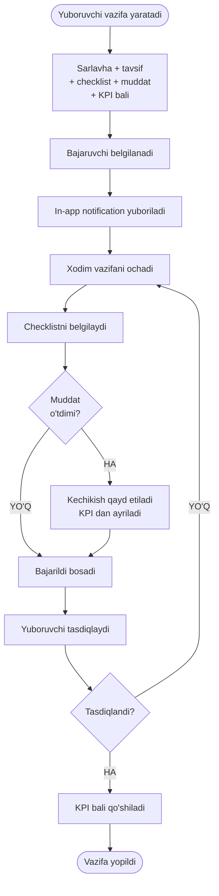
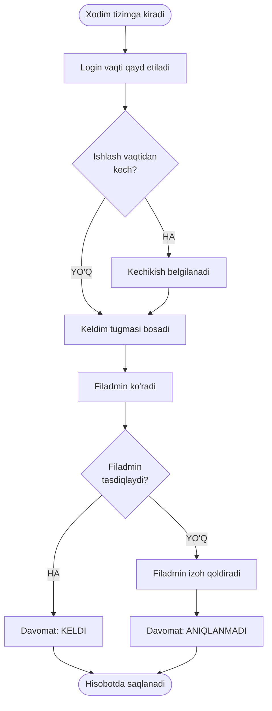
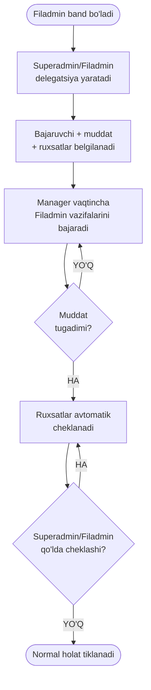

# A'lochi Platforma — Texnik Vazifa (TZ)

**Sana:** 2026-04-23  
**Versiya:** 1.5  
**Loyiha:** A'lochi — O'quv Markazlar uchun SaaS Platforma  
**Mualliflar:** A'lochi Jamoasi  
**Holat:** Ko'rib chiqilmoqda

### Hujjat Tarixi
| Versiya | Sana | O'zgarish |
|---------|------|-----------|
| 1.0 | 2026-04-23 | Dastlabki TZ yaratildi |
| 1.1 | 2026-04-24 | Section raqamlar tuzatildi; MVP scope realistik qilindi (4 oy); AI Faza 2 ga ko'chirildi; YouTube iframe texnik tafsiloti; Telegram single-bot arxitektura; ML data riski qo'shildi; Test strategiyasi (Section 25) qo'shildi; ma'lumotlar modeliga `max_n_override` qo'shildi; WebSocket wss:// tuzatildi |
| 1.2 | 2026-04-24 | Section 2.3 to'liq yangilandi — delegatsiya audit tizimi (majburiy sabab, qabul/rad javobi, timeline tarixi, rollar ko'rinishi); alohida spec: `2026-04-24-delegation-audit-design.md` |
| 1.3 | 2026-04-24 | Section 7.2 yangilandi — Face ID xodim davomat tizimi (Faza 1 qo'lda, Faza 2 avtomatik); alohida spec: `2026-04-24-face-id-attendance-design.md` |
| 1.4 | 2026-04-24 | Section 17b qo'shildi — O'quvchilar ijtimoiy funksiyalari (lenta, do'stlar, duel, challenge, chat); alohida spec: `2026-04-24-social-features-design.md` |
| 1.5 | 2026-04-24 | Section 17b → 18 qayta raqamlandi (barcha keyingi sectionlar +1); Section 12 to'liq wireframes va dizayn tizimi bilan almashtirildi; UAT sektsiyalari 3 ta alohida specga qo'shildi; Section 32 timeline 11→13 oyga yangilandi (Face ID Oy 8, Social Oy 10); Section 28 xarajatlar Face ID pod + WebSocket pod bilan yangilandi; Section 23.6 yangi funksiyalar xavfsizlik tahdidlari qo'shildi; barcha subsection raqamlari tuzatildi |

---

## 1. LOYIHA HAQIDA

### 1.1 Maqsad
A'lochi — O'zbekistondagi o'quv markazlar uchun SaaS ta'lim platformasi. 3–7 sinf o'quvchilariga ingliz tili, shaxsiy rivojlanish va tanqidiy fikrlashni o'rgatadi. Platforma o'quvchilarni kunlik darslarni video, AI savol-javob va kamera orqali topshirishni ta'minlaydi.

### 1.2 Qamrov
- **Foydalanuvchilar:** Million+ o'quvchi (3–7 sinf), xodimlar (Superadmin, Filadmin, Manager, Mentor, Tester)
- **Platform:** Web (responsive) — kompyuter, planshet, telefon
- **Model:** Multi-tenant SaaS (har bir o'quv markaz = alohida tenant)
- **Til:** O'zbek tili (asosiy UI tili)

### 1.3 Asosiy Tamoyillar
- O'quvchi videoni tezlashtira olmaydi
- Har bir dars bosqichini o'tmasdan keyingisiga o'tib bo'lmaydi
- Kamera faqat akademiyada topshirish paytida yoqiladi
- Barcha statuslar (Yashil/Sariq/Qizil) real-time yangilanadi

---

## 2. ROLLAR VA RUXSATLAR

### 2.1 Rollar Jadvali

| Rol | Qamrov | Asosiy Vazifalari |
|-----|--------|------------------|
| **Superadmin** | Butun platforma | Tenantlar, filiallar, darslar, xodimlar, barcha sozlamalar |
| **Filadmin** | 1 filial | Ota-onalar, to'lovlar, xodim qo'shish, filial boshqarish, targ'ibot |
| **Manager** | 1 filial | Qizil/sariq o'quvchilar, tanqidiy fikrlash darsi, sertifikat/sovg'a |
| **Mentor** | O'z guruhi | Shaxsiy rivojlanish darsi, status berish, davomat, guruh nazorati |
| **Tester** | 1 filial | O'quvchilarni kuzatish, tartib, texnik yordam, davomat nazorat |
| **O'quvchi** | O'z darslari | Dars bajarish, statistika ko'rish, yo'l xaritasi |

### 2.2 Ruxsatlar Matritsasi

| Funksiya | Superadmin | Filadmin | Manager | Mentor | Tester | O'quvchi |
|----------|-----------|---------|---------|--------|--------|---------|
| Filial yaratish | ✅ | ❌ | ❌ | ❌ | ❌ | ❌ |
| Xodim qo'shish | ✅ | ✅ | ❌ | ❌ | ❌ | ❌ |
| Dars qo'shish/sozlash | ✅ | ❌ | ❌ | ❌ | ❌ | ❌ |
| Individual N override | ✅ | ✅ | ✅ | ❌ | ❌ | ❌ |
| Ogohlantirish berish | ✅ | ✅ | ❌ | ❌ | ❌ | ❌ |
| Ogohlantirish bekor qilish | ✅ | ✅ | ❌ | ❌ | ❌ | ❌ |
| O'quvchi blok/blokdan chiqarish | ✅ | ✅ | ❌ | ❌ | ❌ | ❌ |
| To'lov muddatini belgilash | ✅ | ❌ | ❌ | ❌ | ❌ | ❌ |
| To'lov qabul qilindi belgilash | ✅ | ✅ | ❌ | ❌ | ❌ | ❌ |
| O'quvchi qo'shish | ✅ | ✅ | ❌ | ❌ | ❌ | ❌ |
| Status berish (shaxsiy) | ❌ | ❌ | ❌ | ✅ | ❌ | ❌ |
| Status berish (tanqidiy) | ❌ | ❌ | ✅ | ❌ | ❌ | ❌ |
| Davomat (o'quvchi) | ❌ | ✅ | ✅ | ✅ | ✅ | ❌ |
| Davomat (xodim) | ❌ | ✅ | ❌ | ❌ | ❌ | ❌ |
| Vazifa yuborish | ✅ | ✅ | ✅ | ❌ | ❌ | ❌ |
| KPI ko'rish | ✅ | ✅ | ✅ | ✅ | ✅ | ❌ |
| O'z statistikasi | ✅ | ✅ | ✅ | ✅ | ✅ | ✅ |
| Hisobotlar | ✅ | ✅ | ✅ | ❌ | ❌ | ❌ |

### 2.3 Vaqtinchalik Delegatsiya

> To'liq dizayn: `docs/superpowers/specs/2026-04-24-delegation-audit-design.md`

#### 2.3.1 Qoidalar
- Superadmin / Filadmin / Manager pastki rollarga vaqtinchalik vakolat bera oladi
- Delegatsiya muddati belgilanadi (boshlanish + tugash sanasi)
- **Sabab maydoni majburiy** — beruvchi nima uchun delegatsiya berayotganini yozadi
- Bir xodimga bir vaqtda faqat 1 ta faol delegatsiya mumkin
- Superadmin/Filadmin/Manager istalgan vaqt bekor qila oladi (sabab bilan)

#### 2.3.2 Oluvchi Javobi
- Oluvchi notification oladi: vakolat ro'yxati + muddat + sabab ko'rsatiladi
- **Qabul qilishi yoki rad etishi shart** — rad etilsa sabab majburiy
- Rad etilsa beruvchiga darhol xabar ketadi, delegatsiya kuchga kirmaydi

#### 2.3.3 Audit Tarixi
Har ikki tomon (beruvchi va oluvchi) o'z delegatsiya tarixini ko'radi:

| Kuzatiladigan voqea | Tavsif |
|--------------------|--------|
| Delegatsiya yaratildi | Kim, kimga, muddat, sabab |
| Qabul qilindi / Rad etildi | Oluvchi javobi + sabab |
| Amal bajarildi | Delegat sifatida: ogohlantirish, to'lov, xodim qo'shish... |
| Bekor qilindi | Kim bekor qildi, sabab |
| Muddat tugadi | Avtomatik (cron job) |

**UI:** Karta ko'rinishi → bosib timeline drill-down ochiladi → PDF eksport

#### 2.3.4 Rollar Ko'rinishi

| Rol | Ko'rish | Yaratish |
|-----|---------|----------|
| Superadmin | Barcha filiallar | ✅ |
| Filadmin | O'z filiali | ✅ |
| Manager | O'zi bergan + o'ziga berilgan | ✅ (pastki rollarga) |
| Mentor / Tester | Faqat o'ziga berilganlar | ❌ |

---

## 3. FUNKSIONAL TALABLAR

### 3.1 Superadmin Paneli

#### 3.1.1 Tenant va Filial Boshqaruvi
- Yangi o'quv markaz (tenant) yaratish
- Filiallarga Filadmin tayinlash
- Filial statistikalarini ko'rish (o'quvchilar soni, o'rtacha status, davomat)

#### 3.1.2 Dars Boshqaruvi
Superadmin har bir darsni quyidagi komponentlar bilan sozlaydi:

| Komponent | Sozlanishi |
|-----------|-----------|
| Video (YouTube URL) | Majburiy |
| MCQ Testlar | Yoq/O'chir + savollar soni |
| So'zlarni tartibga solish | Yoq/O'chir |
| Lug'at (og'zaki) | Yoq/O'chir + so'zlar ro'yxati |
| AI Tutor | Yoq/O'chir + mavzu konteksti va tushuntirish matni |
| Kamera Topshirish | Yoq/O'chir |
| N (takrorlash soni) | 1–10 (superadmin belgilaydi, manager individual o'zgartirishi mumkin) |

**Dars Turlari:**
- Ingliz tili (video + test + lug'at + AI Tutor + kamera)
- Shaxsiy rivojlanish (Mentor o'tadi — tizimda alohida modul)
- Tanqidiy fikrlash (Manager o'tadi — tizimda alohida modul)
- Experiment (superadmin tur tanlaydi)

**Darslar ketma-ketligi:** Superadmin darslarni tartib raqami bilan qo'shadi. O'quvchi oldingi darsni tamomlamasdan keyingisiga o'ta olmaydi.

#### 3.1.3 Xodimlar uchun Video Qo'llanmalar
- Har bir rol uchun alohida bo'lim
- Superadmin YouTube URL qo'shadi
- Xodim o'z roli bo'yicha qo'llanmalarni ko'radi

#### 3.1.4 Ogohlantirish Tizimi Boshqaruvi (Superadmin)
- Istalgan filialdagi istalgan o'quvchiga ogohlantirish berish
- Ogohlantirish limitini sozlash (default: 3 ta = bloklash)
- Bloklangan o'quvchilarni ko'rish va blokdan chiqarish
- Barcha ogohlantirishlar tarixi va sababi ko'rinadi

#### 3.1.5 To'lov Muddatini Belgilash (Superadmin)
- Har oy uchun to'lov muddatini belgilaydi:
  - **Boshlanish sanasi** (masalan: har oyning 1-si)
  - **Tugash sanasi** (masalan: har oyning 10-si)
- Bu sozlama barcha filiallarga avtomatik qo'llaniladi
- Muddatdan o'tgan va to'lov qilmagan o'quvchilar profili **avtomatik bloklanadi**
- Blokdan chiqarish: Filadmin "To'lov qabul qilindi" belgilagandan **keyingi kuni 00:00 da** avtomatik

#### 3.1.6 Mentor Darslari Rejasi
- 250 ta dars: Dunyoqarash (100), Tanqidiy fikrlash (50), 20 ko'nikma (50), Experiment (50)
- Har bir xodim uchun madaniyat darsi

### 3.2 Filadmin Paneli

#### 3.2.1 Dashboard
- Filial umumiy statistikasi (real-time)
- Yashil/Sariq/Qizil o'quvchilar foizi (doira diagramma)
- Kunlik davomat (o'quvchi + xodim)
- Bugungi dars jadvali
- Bajarilmagan vazifalar

#### 3.2.2 Xodim Boshqaruvi
- Manager, Mentor, Tester qo'shish/o'chirish
- Xodim KPI ko'rish
- Vazifa yuborish (sarlavha + checklist + muddat + KPI bali)
- Xodim davomat tarixi

#### 3.2.3 O'quvchi Boshqaruvi
- O'quvchi qo'shish (ism, sinf, guruh, login/parol)
- O'quvchi statusi tarixi
- O'quvchi dars taraqqiyoti
- Ota-ona aloqasi (telefon raqami)

#### 3.2.4 Ogohlantirish Boshqaruvi (Filadmin)
- O'z filialidagi o'quvchiga ogohlantirish berish
- **Ogohlantirish sababi majburiy** (matn bilan izohlanadi)
- Ogohlantirish turlari:
  - Darsga tayyorlanmagan
  - Vazifalarni bajarmagan
  - Intizom buzilishi
  - Boshqa (erkin matn)
- 1-ogohlantirish → O'quvchiga in-app xabar + Telegram orqali ota-onaga xabar
- 2-ogohlantirish → Ota-onaga Telegram xabar + Mentor xabardor
- 3-ogohlantirish → **Profil avtomatik bloklanadi** + Ota-onaga xabar + Filadmin/Superadminga alert
- Berilgan ogohlantirish bekor qilish mumkin (sabab bilan)

#### 3.2.5 To'lov Boshqaruvi (Filadmin)
- O'quvchilar to'lov holati ro'yxati (to'ladi / to'lamadi / muddat o'tdi)
- **"To'lov qabul qilindi"** tugmasi — to'lov sanasi va summasi kiritiladi
- To'lov belgilanganidan keyingi kuni 00:00 da profil avtomatik ochiladi
- Oylik to'lov tarixi (kim to'ladi, qachon, qancha)
- **Muddatga 2 kun qolganda** Telegram orqali ota-onaga avtomatik eslatma

#### 3.2.6 To'lovlar va Targ'ibot
- To'lov belgilash (qo'lda) va tarixi
- Targ'ibot hisoboti (maktablar soni)

### 3.3 Manager Paneli

#### 3.3.1 Dashboard
- Bugungi Sariq + Qizil o'quvchilar ro'yxati (real-time)
- In-app notification: yangi qizil/sariq o'quvchi tushganda
- Kunlik ish rejasi

#### 3.3.2 O'quvchilar Bilan Ishlash
- Sariq → Yashilga ko'tarish rejasi
- Qizil → Sariqqa ko'tarish rejasi
- Har bir o'quvchi uchun 1:1 sessiya (10 daqiqa) yozib qo'yish
- Tanqidiy fikrlash darsi o'tish va status berish
- **200%+ o'quvchilar** (yuqori natijalar): ularga alohida qiyinroq topshiriqlar berish

#### 3.3.3 Individual Training Soni (N) Boshqaruvi
Manager har bir o'quvchi uchun superadmin belgilagan N ni individual o'zgartira oladi:

| Holat | Misol | Harakat |
|-------|-------|---------|
| O'quvchi tez o'rganadi | Dars 1 ni 1 sessiyada a'lo o'tdi | N ni 5 dan 2 ga kamaytiradi |
| O'quvchi qiynaladi | Dars 7 ni 5 marta o'tsa ham tushunmaydi | N ni 5 dan 8 ga oshiradi |
| Guruhga mos emas | Bir guruhda tez va sekin o'quvchilar | Har biriga alohida N |

**Qoidalar:**
- Manager faqat o'z filialidagi o'quvchilar N ini o'zgartiradi
- Superadmin belgilagan N — default qiymat (global)
- Manager o'zgartirishi — individual override (faqat o'sha o'quvchi uchun)
- O'zgartirishlar tarixi loglarda saqlanadi (kim, qachon, qancha qildi)
- Superadmin va Filadmin barcha individual N o'zgartirishlarini ko'ra oladi

#### 3.3.4 Sertifikat va Sovg'alar
- O'quvchiga sertifikat berish
- Sovg'a/kitob belgilash

### 3.4 Mentor Paneli

#### 3.4.1 Dashboard
- O'z guruhi o'quvchilari statusi
- Bugungi dars rejasi
- Guruh o'rtacha foizi

#### 3.4.2 Dars O'tish
- Kunlik ish rejasiga ko'ra shaxsiy rivojlanish darsi
- Dars o'tgandan so'ng belgilash (15 daqiqa minimal)
- Har bir o'quvchiga ball qo'yish (maks 20 ta o'quvchi/dars)

#### 3.4.3 Status Berish
- O'z guruhidagi o'quvchiga Yashil/Sariq/Qizil berish (shaxsiy rivojlanish bo'yicha)
- Sariq/Qizil bersa → avtomatik Managerni xabardor qiladi
- Izoh qoldirish imkoniyati

#### 3.4.4 Guruh Davomati
- Har kuni guruh o'quvchilari davomati (keldi/kelmadi)

### 3.5 Tester Paneli

#### 3.5.1 Dashboard
- Bugungi topshiradigan o'quvchilar jadvali
- Vaqt nazorati (navbat tartibi)

#### 3.5.2 O'quvchi Kuzatuvi
- O'quvchi akademiyaga kirishida belgilash
- Topshirish navbatini boshqarish
- Tartib-intizom eslatmalari
- Texnik muammo (kamera, internet) — yordam berish

### 3.6 O'quvchi Paneli

#### 3.6.0 Bloklangan Holat
Agar o'quvchi profili bloklangan bo'lsa:
- Tizimga kirish **mumkin emas** (eski login/parol ishlamaydi)
- Faqat A'lochi **asosiy (landing) sahifasi** ko'rinadi
- Bloklash sababi login sahifasida ko'rsatiladi:
  - `⚠️ Profilingiz 3 ta ogohlantirish sababli bloklangan. Filadmin bilan bog'laning.`
  - `💳 To'lov muddati o'tdi. To'lovni amalga oshirgach, ertasi kuni kirish tiklanaadi.`

#### 3.6.1 Bosh Sahifa
- Yo'l xaritasi (500 qadam) — hozirgi pozitsiya, keyingi maqsad
- Bugungi vazifa (qaysi dars)
- 3 ta status (Ingliz tili / Shaxsiy rivojlanish / Tanqidiy fikrlash) — Yashil/Sariq/Qizil
- Umumiy statistika (foiz, streak)
- Sertifikat va mukofotlar

#### 3.6.2 Ogohlantirish Ko'rsatkichi
- O'quvchi o'z ogohlantirishlarini ko'radi (soni + sabab + sana)
- `⚠️ 2/3 ogohlantirish — Yana 1 ta ogohlantirish profilingizni bloklaydi`
- Bloklash xavfi ko'rsatilganda Mentor ham xabardor qilinadi

#### 3.6.3 Darslar Bo'limi
- Barcha darslar ro'yxati (qulflangan/ochiq)
- Hozirgi dars tugmasini bosish
- Har bir dars uchun N marta topshirish sanagichi

---

## 4. O'QUVCHI DARS JARAYONI (To'liq Flow)

### 4.1 Uy Qismi

```
O'quvchi tizimga kiradi
         ↓
Yo'l xaritasidan joriy darsni ochadi
         ↓
┌──────────────────────────────────────┐
│ BOSQICH 1: VIDEO                      │
│ • YouTube iframe API embed            │
│ • Istalgan marta ko'rish mumkin       │
│ • Tezlashtirish BLOKLANGAN           │
│ • Ko'rmagan holda o'tib bo'lmaydi    │
│ • Ko'rish foizi kuzatiladi (>90%)    │
└──────────────────────────────────────┘
         ↓
┌──────────────────────────────────────┐
│ BOSQICH 2: TESTLAR                    │
│ (Superadmin yoqqan komponentlar)      │
│                                       │
│ a) MCQ — Ko'p tanlovli test           │
│ b) So'zlarni tartibga solish          │
│ c) Lug'at: AI o'zbekcha aytadi →     │
│    o'quvchi inglizcha aytadi          │
│    Azure talaffuzni tekshiradi        │
│    ❌ Noto'g'ri → qaytadan            │
│    ✅ To'g'ri → davom etadi           │
│                                       │
│ ❌ Biror testdan o'tmasa → 1-bosqich │
│ ✅ N marta muvaffaqiyatli = sessiya   │
└──────────────────────────────────────┘
         ↓
┌──────────────────────────────────────┐
│ BOSQICH 3: AI TUTOR                  │
│ • Claude API — dars bo'yicha tutor   │
│ • O'quvchi savolini beradi           │
│   (og'zaki yoki yozma)               │
│ • AI darsni professional tushuntiradi│
│ • Cheksiz savol berish mumkin        │
│ • Min. 1 savol berilmasa davom yo'q  │
│ • ✅ "Tayyor" bosadi → keyingi bosqich│
└──────────────────────────────────────┘
         ↓
   UY QISMI TUGADI ✅
   Akademiyaga borish kerak
```

### 4.2 Akademiya Qismi

```
O'quvchi akademiyaga keladi
         ↓
Tester kirishini belgilaydi (davomat)
         ↓
Navbat kelganda Tester yo'naltiradi
         ↓
┌──────────────────────────────────────┐
│ BOSQICH 4: KAMERA TOPSHIRISH          │
│ • MediaPipe yuz aniqlaydi            │
│ • Boshqa tomonga qarasa:             │
│   AI ovozli ogohlantiradi            │
│ • Uzoq jim qolsa → 1-bosqichga       │
│ • Noto'g'ri topshirsa → 1-bosqichga  │
│                                       │
│ AI YAKUNIY BAHOLASH (Claude API):    │
│ • Barcha javoblarni tahlil qiladi    │
│ • Ingliz tili statusi beradi         │
│   (Yashil / Sariq / Qizil)          │
└──────────────────────────────────────┘
         ↓
      O'TDI?
     ↙      ↘
   HA        YO'Q
    ↓           ↓
Keyingi     1-bosqichdan
dars ochiq  qaytadan boshlaydi
```

---

## 5. STATUS TIZIMI

### 5.1 3 Ta Alohida Status

Har bir o'quvchida **3 ta mustaqil status** bo'ladi:

| Status | Kim Beradi | Qachon |
|--------|-----------|--------|
| **Ingliz tili** | AI (avtomatik) | Kamera topshirishdan keyin |
| **Shaxsiy rivojlanish** | Mentor | Mentor darsi va kuzatuvdan keyin |
| **Tanqidiy fikrlash** | Manager yoki Avtomatik | Shaxsiy rivojlanish statusiga bog'liq |

### 5.2 Tanqidiy Fikrlash Status Logikasi

```
Mentor → Shaxsiy rivojlanish status beradi
                    ↓
               YASHIL?
             ↙         ↘
           HA            YO'Q (Sariq/Qizil)
            ↓                    ↓
  Tanqidiy fikrlash      Manager xabardor qilinadi
  avtomatik YASHIL               ↓
                         Manager dars o'tadi
                                 ↓
                     Manager tanqidiy fikrlash
                         statusini beradi
```

### 5.3 Status Ta'siri
- **Qizil** → Manager ro'yxatiga avtomatik qo'shiladi
- **Sariq** → Manager ro'yxatiga qo'shiladi, ustuvor emas
- **Yashil** → Yo'l xaritasida progress ko'rsatiladi

---

## 6. VAZIFA TIZIMI (Task Management)

### 6.1 Vazifa Yaratish
Superadmin, Filadmin, Manager — o'zidan pastki rol xodimiga vazifa yuboradi:

```
Vazifa tarkibi:
├── Sarlavha (majburiy)
├── Tavsif
├── Checklist (kichik qadamlar, ixtiyoriy)
├── Muddat (deadline)
├── KPI bali (bajarilsa avtomatik qo'shiladi)
└── Bajaruvchi (bir yoki bir nechta)
```

### 6.2 Vazifa Holatlari
`Yuborildi → Ko'rildi → Bajarilmoqda → Bajarildi → Tasdiqlandi`

### 6.3 Bildirishnomalar
- Yangi vazifa kelganda → in-app notification
- Muddat yaqinlashganda → in-app eslatma (24 soat oldin)
- Bajarilganda → yuboruvchi notification oladi

---

## 7. DAVOMAT TIZIMI

### 7.1 O'quvchi Davomati
- **Kim belgilaydi:** Mentor (o'z guruhi), Tester (nazorat)
- **Vaqt:** Har kuni akademiya ochilishida
- **Holat:** Keldi / Kelmadi / Kech keldi
- **Ta'siri:** O'quvchi statusi hisoblashida hisobga olinadi

### 7.2 Xodim Davomati

> To'liq dizayn: `docs/superpowers/specs/2026-04-24-face-id-attendance-design.md`

**Faza 1 — Qo'lda (MVP):**
```
Xodim tizimga kiradi → "Keldim" tugmasini bosadi
        ↓
Filadmin tasdiqlaydi → Davomat saqlanadi
Kechikish: login vaqti > ish boshlanish vaqti → avtomatik belgilanadi
```

**Faza 2 — Face ID (Avtomatik):**
```
Filial kirishida Android planshet (kiosk rejimi)
        ↓
Xodim yuzini ko'rsatadi → face-api.js aniqlaydi
        ↓ (ishonch < 80%)
Server fallback: Python face_recognition
        ↓
Aniqlandi → Kelish vaqti vs ish boshlanish vaqti
  → ✅ Keldi  yoki  ⏰ Kech keldi (N daqiqa)
        ↓
Aniqlanmadi → Qo'lda login + Filadminga notification
```

- **Enrollment:** Xodim telefonidan profil → "Yuzimni ro'yxatdan o'tkazish" (bir marta)
- **Offline:** Kunlik kesh planshetda saqlanadi — internet yo'q bo'lsa ham ishlaydi
- **Kechikish toleransi:** Filial sozlamalarida (default: 5 daqiqa)
- **Hisobot:** Filadmin — kunlik/haftalik/oylik, usul ko'rsatiladi (👁 Yuz / 🔑 Qo'lda)

---

## 8. KPI TIZIMI

### 8.1 Mentor KPI (Har dars)
| Ko'rsatkich | Maqsad | Ball |
|------------|--------|------|
| Darsda o'quvchi soni | 20 ta | +5 |
| Dars davomiyligi | Min 15 daqiqa | +5 |
| Balllar qo'yilishi | 20 ta o'quvchiga | +5 |
| Vaqtida habar berish | Qizil o'quvchi | +5 |

### 8.2 Manager KPI (Har kun)
| Ko'rsatkich | Maqsad | Ball |
|------------|--------|------|
| Qizildan sariqqa ko'tarish | Har o'quvchi | +10 |
| Sariqdan yashilga ko'tarish | Har o'quvchi | +15 |
| 1:1 sessiya | 10 daqiqa | +5 |

### 8.3 Filadmin KPI (Oylik)
| Ko'rsatkich | Maqsad |
|------------|--------|
| Barcha xodim KPI 100% | Bonus |
| Filial o'quvchilari hammasi yashil | Bonus |
| Qizil o'quvchilar ortishi | Jarima |

---

## 9. USE CASES (Foydalanish Holatlari)

### UC-001: O'quvchi Uy Darsini Bajarish
**Ishtirokchilar:** O'quvchi, Claude API, Azure Speech  
**Asosiy stsenariy:**
1. O'quvchi tizimga kiradi
2. Joriy darsni ochadi
3. YouTube videoni to'liq ko'radi (tezlashtirmasdan)
4. Testlarni boshlaydi (MCQ / so'z tartibi / lug'at)
5. Lug'at: Azure talaffuz tekshiradi; noto'g'ri → qaytadan
6. AI Tutor: O'quvchi dars bo'yicha savollarini beradi (og'zaki/yozma); AI tushuntiradi; "Tayyor" bosib davom etadi
7. N marta muvaffaqiyatli o'tadi → "Akademiyaga bor" xabari

**Muqobil stsenariy:**
- Testdan o'tmasa → 1-bosqichdan qayta boshlaydi
- AI Tutor da hech savol bermasdan "Tayyor" bossa → davom ettirilmaydi
- Sessiya N marta to'lmasa → keyingi dars qulflangan qoladi
- Manager individual N ni o'zgartirgan bo'lsa → o'sha N qo'llaniladi

---

### UC-002: O'quvchi Akademiyada Topshirish
**Ishtirokchilar:** O'quvchi, Tester, MediaPipe, Claude API  
**Asosiy stsenariy:**
1. Tester o'quvchi kelganini belgilaydi (davomat)
2. Tester navbat kelganda yo'naltiradi
3. O'quvchi kameraga o'tiradi, MediaPipe yuzni aniqlaydi
4. Dars bo'yicha topshirish boshlanadi (kamera yoqiq)
5. Boshqa tomonga qarasa → AI ovozli ogohlantiradi
6. Claude API yakuniy baholaydi
7. Status beriladi (Yashil/Sariq/Qizil) — Ingliz tili

**Muqobil stsenariy:**
- Jim qolsa/noto'g'ri → 1-bosqichdan qayta boshlaydi
- Kamera aniqlamasa → Tester texnik yordam beradi

---

### UC-003: Superadmin Dars Qo'shish
**Ishtirokchilar:** Superadmin  
**Asosiy stsenariy:**
1. Superadmin dars boshqaruviga kiradi
2. Yangi dars yaratadi (nom, tur, tartib raqami)
3. YouTube URL qo'shadi
4. Komponentlarni yoqadi/o'chiradi (MCQ, lug'at, AI Tutor, kamera)
5. Har komponent uchun kontent qo'shadi (savollar, so'zlar, tutor konteksti)
6. N (takrorlash soni) belgilaydi — Manager individual o'zgartirishi mumkin
7. Darsni saqlaydi va e'lon qiladi

---

### UC-004: Mentor Status Berish
**Ishtirokchilar:** Mentor, Manager (agar sariq/qizil)  
**Asosiy stsenariy:**
1. Mentor dars o'tgandan so'ng o'quvchilarni baholaydi
2. Har o'quvchiga Yashil/Sariq/Qizil beradi (shaxsiy rivojlanish)
3. Yashil → tanqidiy fikrlash ham avtomatik Yashil
4. Sariq/Qizil → Manager xabardor (notification)
5. Manager o'sha o'quvchiga tanqidiy fikrlash darsi o'tadi
6. Manager tanqidiy fikrlash statusini belgilaydi

---

### UC-005: Manager Qizil O'quvchi Bilan Ishlash
**Ishtirokchilar:** Manager, O'quvchi  
**Asosiy stsenariy:**
1. Manager qizil/sariq ro'yxatini ko'radi (dashboard)
2. O'quvchi bilan 1:1 sessiya rejalashtiradi
3. 10 daqiqa individual dars o'tadi
4. Tanqidiy fikrlash statusi yangilanadi
5. KPI avtomatik hisoblanadi

---

### UC-006: Xodim Vazifasini Bajarish
**Ishtirokchilar:** Xodim (Mentor/Manager/Tester), Yuboruvchi  
**Asosiy stsenariy:**
1. Xodim yangi vazifa notification oladi
2. Vazifani ochadi, checklist ko'radi
3. Har bir checklistni bajaradi va belgilaydi
4. "Bajarildi" tugmasini bosadi
5. Yuboruvchi tasdiqlaydi
6. KPI bali avtomatik qo'shiladi

---

### UC-007a: O'quvchi AI Tutor bilan Ishlash
**Ishtirokchilar:** O'quvchi, Claude API (AI Tutor)  
**Shart:** Testlar (Bosqich 2) muvaffaqiyatli o'tilgan  
**Asosiy stsenariy:**
1. O'quvchi "AI Tutor" bo'limiga o'tadi
2. Dars mavzusida savolini yozadi yoki og'zaki aytadi
3. Claude API darsni professional tushuntiradi (o'zbek tilida)
4. O'quvchi boshqa savol beradi — cheksiz takrorlash mumkin
5. Qachon tayyor bo'lsa "Tayyor" tugmasini bosadi
6. Tizim min. 1 savol berilganini tekshiradi → ✅ davom etadi

**Muqobil stsenariy:**
- 0 savol bilan "Tayyor" bossa → "Kamida 1 ta savol bering" xabari
- AI javob 3 soniyadan kech kelsa → loading indikator ko'rsatiladi
- Internet uzilsa → savol va javoblar local storage da saqlanadi

**Postulovlar:** AI Tutor sessiyasi tugagan → Bosqich 3 bajarildi belgisi qo'yiladi

---

### UC-007b: Manager Individual N Override
**Ishtirokchilar:** Manager, O'quvchi  
**Shart:** Manager o'quvchining dars taraqqiyotini ko'rmoqda  
**Asosiy stsenariy:**
1. Manager o'quvchi profiliga kiradi
2. "Training sozlamalari" bo'limini ochadi
3. Kerakli darsni tanlaydi
4. N qiymatini o'zgartiradi (superadmin default: 5 → yangi: 3 yoki 8)
5. Izoh qoldiradi (ixtiyoriy): "Tez o'rganadi" / "Qo'shimcha mashq kerak"
6. Saqlaydi → o'sha o'quvchi uchun yangi N kuchga kiradi
7. O'zgarish loglarda saqlanadi

**Muqobil stsenariy:**
- N qiymatini 0 ga qo'ysa → "Min. 1 ta sessiya kerak" xabari
- N qiymatini superadmin maksimumidan oshirsa → superadmin ruxsati kerak

---

### UC-008a: Ogohlantirish Berish va Bloklash
**Ishtirokchilar:** Filadmin yoki Superadmin, O'quvchi, Ota-ona (Telegram)
**Asosiy stsenariy:**
1. Filadmin o'quvchi profiliga kiradi → "Ogohlantirish berish" tugmasi
2. Ogohlantirish turini tanlaydi + izoh yozadi
3. Tasdiqlaydi → ogohlantirish yoziladi
4. Tizim aktiv ogohlantirishlar sonini hisoblaydi
5. **1-2 ta:** O'quvchiga in-app + ota-onaga Telegram xabar
6. **3 ta:** Profil **avtomatik bloklanadi** + barcha tomonlarga xabar

**Muqobil stsenariy — Ogohlantirish bekor qilish:**
1. Filadmin/Superadmin ogohlantirish tarixiga kiradi
2. "Bekor qilish" bosadi + sabab yozadi
3. Aktiv soni 3 dan pastga tushsa → profil avtomatik ochiladi

---

### UC-008b: To'lov Muddati va Bloklash
**Ishtirokchilar:** Superadmin (sozlash), Filadmin (belgilash), Cron Job (avtomatik)
**Asosiy stsenariy:**
1. Superadmin oylik muddatni belgilaydi (masalan: 1–10 sana)
2. Har oyning 10-si kechqurun 23:59 da Cron Job ishlaydi
3. To'lov yozilmagan barcha o'quvchilar profili **bloklanadi**
4. Ota-onaga Telegram: `"To'lov muddati o'tdi. To'lovni keltiring."`
5. O'quvchi to'lovni olib keladi → Filadmin "To'lov qabul qilindi" belgilaydi
6. `unblock_at = bugun + 1 kun 00:00` belgilanadi
7. Ertasi kuni 00:00 da Cron Job → profil avtomatik ochiladi

**Muqobil stsenariy:**
- Muddatga 2 kun qolganida Telegram eslatma (avvaldan)
- Filadmin to'lovni belgilamaguncha profil bloklangan qoladi

---

### UC-009: Kunlik Davomat Belgilash
**Ishtirokchilar:** Mentor (o'quvchi), Filadmin (xodim)  
**O'quvchi davomati:**
1. Mentor guruh ro'yxatini ochadi
2. Har o'quvchiga keldi/kelmadi/kech belgilaydi
3. Saqlaydi → hisobotda ko'rinadi

**Xodim davomati:**
1. Xodim tizimga kiradi (login vaqti qayd)
2. "Keldim" bosadi
3. Filadmin tasdiqlaydi
4. Kechikish avtomatik belgilanadi

---

## 10. BPMN DIAGRAMMALAR

### BPMN-001: O'quvchi To'liq Dars Jarayoni



---

### BPMN-001b: AI Tutor Sessiyasi



---

### BPMN-001c: Manager Individual N Override



---

### BPMN-006: Ogohlantirish va Bloklash Jarayoni



---

### BPMN-007: To'lov Muddati va Bloklash Jarayoni



---

### BPMN-002: Status Belgilash Jarayoni



---

### BPMN-003: Vazifa Jarayoni



---

### BPMN-004: Xodim Davomati Jarayoni



---

### BPMN-005: Vaqtinchalik Delegatsiya



---

## 11. TEXNIK ARXITEKTURA

### 11.1 Gibrid Arxitektura

```
┌─────────────────────────────────────────────┐
│              CLOUDFLARE CDN                  │
│         (DDoS himoya, edge cache)           │
└─────────────────┬───────────────────────────┘
                  │
┌─────────────────▼───────────────────────────┐
│           NEXT.JS 15 FRONTEND                │
│    App Router + Server Components            │
│    Responsive (mob/tablet/desktop)           │
└──────┬──────────────────────┬───────────────┘
       │                      │
┌──────▼──────┐     ┌────────▼────────────────┐
│  CORE API   │     │      AI SERVICE          │
│  NestJS     │     │    FastAPI (Python)       │
│  PostgreSQL │     │  Claude API (Q&A)         │
│  Redis      │     │  Azure Speech (talaffuz)  │
└──────┬──────┘     │  MediaPipe (brauzerda)    │
       │            └────────┬────────────────┘
┌──────▼──────┐              │
│  ANALYTICS  │    ┌────────▼────────────────┐
│  ClickHouse │    │    YOUTUBE EMBED         │
│  (Hisobotlar│    │  Signed token + no-speed │
└─────────────┘    └─────────────────────────┘
```

### 11.2 Multi-tenancy
```
PostgreSQL:
  ├── tenant_id column (har bir jadvalda)
  ├── Row-Level Security (RLS) politikasi
  └── Index: tenant_id + created_at

Redis:
  └── namespace: tenant:{id}:*
```

### 11.3 Asosiy Ma'lumotlar Modeli

```
tenants (o'quv markazlar)
  ├── id, name, slug, status
  └── created_at

branches (filiallar)
  ├── id, tenant_id, name
  └── filadmin_id

users (barcha foydalanuvchilar)
  ├── id, tenant_id, branch_id
  ├── role (superadmin/filadmin/manager/mentor/tester/student)
  ├── name, phone, login, password_hash
  └── status, created_at

lessons (darslar)
  ├── id, tenant_id, title, type, order_number
  ├── youtube_url
  ├── n_repetitions (default — superadmin belgilaydi, uy qismi uchun)
  ├── max_n_override (int, default: 10 — manager bu limitdan yuqori N bera olmaydi)
  └── components (JSON: {mcq, word_order, vocabulary, ai_tutor, camera})

lesson_components (dars tarkibi)
  ├── lesson_id, type (mcq/vocabulary/ai_qa/camera)
  └── config (JSON: savollar, so'zlar, kontekst)

student_progress (o'quvchi taraqqiyoti)
  ├── student_id, lesson_id
  ├── session_count (N dan nechasi o'tildi)
  ├── home_completed (bool)
  ├── academy_completed (bool)
  └── completed_at

student_lesson_config (individual N override)
  ├── student_id, lesson_id
  ├── n_repetitions_override (manager tomonidan o'rnatilgan N)
  ├── changed_by (manager_id)
  ├── changed_at
  └── reason (izoh — ixtiyoriy)

lessons (dars) jadvaliga qo'shimcha:
  └── max_n_override (int, default: 10) — superadmin belgilaydi; manager bu limitdan yuqoriga o'zgartira olmaydi

student_status (3 ta status)
  ├── student_id, date
  ├── english_status (green/yellow/red) + english_note
  ├── personal_status (green/yellow/red) + personal_note
  └── critical_status (green/yellow/red) + critical_note

attendance_students (o'quvchi davomat)
  ├── student_id, date, status (present/absent/late)
  └── marked_by (mentor_id)

attendance_staff (xodim davomat)
  ├── user_id, date, login_time
  ├── confirmed_at (bool), confirmed_by
  └── late (bool)

tasks (vazifalar)
  ├── id, tenant_id, from_user_id, to_user_id
  ├── title, description, deadline, kpi_score
  ├── status (sent/seen/in_progress/done/confirmed)
  └── checklist (JSON array)

kpi_scores (KPI ballari)
  ├── user_id, date, score, reason
  └── task_id (nullable)

warnings (ogohlantirishlar)
  ├── id, tenant_id, student_id
  ├── given_by (superadmin_id yoki filadmin_id)
  ├── reason_type (not_prepared / no_homework / discipline / other)
  ├── reason_text (izoh matni — majburiy)
  ├── is_cancelled (bool, default: false)
  ├── cancelled_by, cancelled_at, cancel_reason
  └── created_at

  — Aktiv ogohlantirish soni = WHERE is_cancelled=false
  — 3 ta aktiv → student.status = 'blocked_warning'

payment_settings (oylik to'lov muddati — tenant darajasida)
  ├── id, tenant_id
  ├── payment_start_day (1–28, oyning boshlanish kuni)
  ├── payment_end_day   (1–28, oyning tugash kuni)
  └── updated_by, updated_at

payments (o'quvchi to'lovlari)
  ├── id, tenant_id, student_id
  ├── month (YYYY-MM formati)
  ├── amount (so'm)
  ├── paid_at (to'lov qabul qilingan sana)
  ├── recorded_by (filadmin_id)
  └── unblock_at (paid_at + 1 kun, 00:00 — cron tomonidan ishlatiladi)

  — To'lov yozilmagan + deadline o'tgan → student.status = 'blocked_payment'
  — unblock_at vaqti kelganda → student.status = 'active' (cron job)
```

### 11.4 AI Komponentlar

| Komponent | Texnologiya | Qayerda ishlaydi |
|-----------|------------|-----------------|
| Yuz aniqlash | MediaPipe Face Detection | Brauzerda (JS) |
| Talaffuz tekshirish | Azure Pronunciation Assessment | Server (AI Service) |
| AI Tutor (chat) | Claude API (claude-sonnet-4-6) | Server (AI Service) |
| Yakuniy baholash | Claude API (claude-sonnet-4-6) | Server (AI Service) |

### 11.5 Xavfsizlik
- **Auth:** JWT (15 min) + Refresh Token (7 kun) → Redis
- **RBAC:** Har bir endpoint rol tekshiradi
- **Video:** YouTube Unlisted + tizim orqali embed (URL faqat server tomonidan beriladi, frontend `allowFullscreen` va download bloklanadi; tezlik o'zgartirish YouTube iframe API `onStateChange` event orqali ushlanib 1x ga qaytariladi)
- **Kamera:** Faqat dars sessiyasida yoqiladi, video saqlanmaydi
- **Ma'lumot:** O'quvchi yuz ma'lumoti server ga yuborilmaydi (MediaPipe brauzerda)
- **PDPL:** O'zbekiston shaxsiy ma'lumotlar to'g'risidagi qonunga mos

---

## 12. UI/UX TALABLAR

> Batafsil Figma wireframelari alohida dizayn faylida. Quyida asosiy ekranlar skelet wireframe'lari.

### 12.1 O'quvchi Paneli — Dizayn Tamoyillari
- **Dizayn:** 8–13 yosh uchun — rangli, animatsiyali, o'yin elementlari
- **Yo'l xaritasi:** 500 qadam vizual, har qadam o'tilganda rang o'zgaradi
- **Gamifikatsiya:** XP, badge, streak, level, virtual shahar
- **Motivatsiya:** "Barakalla!", "Ajoyib!" — audio + vizual
- **Responsive:** Mobile-first (telefon → planshet → kompyuter)

#### O'quvchi Bosh Sahifa (Dashboard)
```
┌─────────────────────────────────────────────────┐
│  🏙️ Shahar: Shaharcha   🔥 Streak: 12 kun       │
│  ▓▓▓▓▓▓▓▓░░  2,340 / 5,000 XP  (Scholar → Expert)│
├─────────────────────────────────────────────────┤
│  📊 STATUSLARIM                                  │
│  🟢 Ingliz tili   🟡 Shaxsiy   🟢 Tanqidiy      │
├─────────────────────────────────────────────────┤
│  📍 YO'L XARITASI  —  Dars #47 / 500            │
│  ✅✅✅✅✅✅✅✅✅✅ ← ← ← ← ← ← ← ←         │
│  [▶️ Bugungi darsni boshlash]                   │
├─────────────────────────────────────────────────┤
│  🎯 BUGUNGI TOPSHIRIQLAR           2/3 bajarildi │
│  ✅ 3 yangi so'z o'rgan            +75 XP       │
│  ✅ Videoni to'xtatmasdan ko'r     +50 XP       │
│  ⬜ AI Tutor ga 3+ savol ber       +100 XP      │
├─────────────────────────────────────────────────┤
│  👥 DO'STLAR LENTASI                            │
│  Sardor Dars #48 o'tdi! +100 XP  [👍][⚡Duel]  │
│  Malika Gold sertifikat oldi! 🏅  [🎉]          │
└─────────────────────────────────────────────────┘
```

#### O'quvchi Dars Sahifasi
```
┌─────────────────────────────────────────────────┐
│  ← Dars #47: Present Simple           3/5 sessiya│
│  ▓▓▓▓▓░░░░░  60%                               │
├─────────────────────────────────────────────────┤
│                                                  │
│  [1. VIDEO ✅] → [2. TEST ✅] → [3. AI TUTOR]  │
│                                   ← hozir shu  │
│                              → [4. AKADEMIYA 🔒]│
│                                                  │
│  ┌────────────────────────────────────────────┐ │
│  │ 🤖 AI Tutor — Present Simple mavzusi       │ │
│  │                                            │ │
│  │ Siz: "do" va "does" qachon ishlatiladi?    │ │
│  │                                            │ │
│  │ AI: I/you/we/they → "do"                  │ │
│  │     he/she/it → "does" ishlatiladi...      │ │
│  └────────────────────────────────────────────┘ │
│  [🎤 Og'zaki] [✍️ Yozing...]    [Tayyor ✅]   │
└─────────────────────────────────────────────────┘
```

---

### 12.2 Filadmin Paneli

#### Filadmin Dashboard
```
┌─────────────────────────────────────────────────┐
│  FILIAL: Yunusobod  •  24-aprel, Chorshanba     │
├──────────┬──────────┬──────────┬────────────────┤
│ 🟢 Yashil│ 🟡 Sariq │ 🔴 Qizil │ 📅 Davomat    │
│  142 (71%)│  38 (19%)│  21 (10%)│  181/201 (90%)│
├──────────┴──────────┴──────────┴────────────────┤
│  ⚠️ DIQQAT                                      │
│  • 3 o'quvchi to'lov muddati o'tdi              │
│  • 2 xodim kech keldi                           │
│  • Kamola Nazarova kelmadi                      │
├─────────────────────────────────────────────────┤
│  XODIMLAR DAVOMATI             [Barchasi →]     │
│  ✅ Nodira  08:55  👁 Yuz                       │
│  ⏰ Alisher 09:14  👁 Yuz  (+14 daq kech)       │
│  ❌ Kamola  —      Kelmadi                      │
├─────────────────────────────────────────────────┤
│  BUGUNGI VAZIFALAR             [Barchasi →]     │
│  ⬜ Sardorni qizildan sariqqa ko'tarish (Manager)│
│  ⬜ Yangi o'quvchi ro'yxatga olish (Tester)     │
└─────────────────────────────────────────────────┘
```

---

### 12.3 Manager Dashboard
```
┌─────────────────────────────────────────────────┐
│  MANAGER PANELI  •  Bugun: 24-aprel             │
├─────────────────────────────────────────────────┤
│  🔴 QIZIL O'QUVCHILAR (7 ta)    [Barchasi →]   │
│  Sardor R.  •  3 kun kelmadi    [1:1 Rejalashtir]│
│  Jasur M.   •  Status qizil 5kun [1:1 Rejalashtir]│
├─────────────────────────────────────────────────┤
│  🟡 SARIQ O'QUVCHILAR (21 ta)   [Barchasi →]   │
│  Malika Y.  •  Streak uzildi    [Ko'rish →]     │
├─────────────────────────────────────────────────┤
│  📊 BUGUNGI KPI                                 │
│  ▓▓▓▓▓▓▓░░░  70 / 100 ball                     │
│  ✅ 2 ta qizildan sariqqa ko'tarildi  +20 ball  │
│  ⬜ 1 ta 1:1 sessiya bajarilmagan               │
└─────────────────────────────────────────────────┘
```

---

### 12.4 Mentor Dashboard
```
┌─────────────────────────────────────────────────┐
│  MENTOR: Nodira  •  5A Guruh  •  18 o'quvchi   │
├─────────────────────────────────────────────────┤
│  GURUH HOLATI                                   │
│  🟢 12  🟡 4  🔴 2   O'rtacha: 74%            │
├─────────────────────────────────────────────────┤
│  BUGUNGI DAVOMAT              [Belgilash →]     │
│  ✅ Keldi: 16    ❌ Kelmadi: 2                  │
├─────────────────────────────────────────────────┤
│  DARS O'TISH                                    │
│  📚 Shaxsiy rivojlanish — Dars #23             │
│  [▶️ Darsni boshlash]  •  Min: 15 daq          │
├─────────────────────────────────────────────────┤
│  💬 GURUH CHATI               [Ochish →]        │
│  Sardor: "Dars #47 ni o'tdim! 🎉"  2 min       │
└─────────────────────────────────────────────────┘
```

---

### 12.5 Navigatsiya Tuzilmasi

**O'quvchi navigatsiyasi (pastki tab bar — mobil):**
```
[🏠 Bosh] [📚 Darslar] [👥 Do'stlar] [🏆 Reyting] [👤 Profil]
```

**Xodim navigatsiyasi (yon panel — desktop/tablet):**
```
├── 🏠 Dashboard
├── 👥 O'quvchilar
├── 📋 Vazifalar
├── 📅 Davomat
├── 🔑 Delegatsiyalar
├── 📊 Hisobotlar
└── ⚙️ Sozlamalar
```

### 12.6 Dizayn Tizimi (Design System)

| Element | Qiymat |
|---------|--------|
| Asosiy rang | #4F46E5 (indigo) |
| Yashil status | #22C55E |
| Sariq status | #EAB308 |
| Qizil status | #EF4444 |
| Font | Inter (xodim), Nunito (o'quvchi — yumaloqroq) |
| Border radius | 12px (karta), 8px (tugma) |
| Animatsiya | Framer Motion — spring-based |
| Ikonlar | Lucide React |

---

## 13. MIQYOSLANISH

| Mezon | Maqsad | Yechim |
|-------|--------|--------|
| Bir vaqtda foydalanuvchi | 100,000+ | Horizontal scaling (Core API) |
| AI so'rovlar (dars vaqti) | 10,000/daqiqa | AI Service autoscaling |
| Video stream | 50,000+ | Cloudflare CDN + YouTube |
| Ma'lumotlar bazasi | 10M+ yozuv | PostgreSQL + Read replicas |
| Hisobotlar | Real-time | ClickHouse (OLAP) |

---

## 14. LOYIHA FAZALARI

*To'liq fazalar rejasi uchun Section 22 ga qarang.*

---

## 15. ADAPTIV O'QITISH (AI-Powered)

### 15.1 Zaif Tomonlarni Aniqlash
- AI har sessiyadan keyin o'quvchining xatolarini tahlil qiladi
- Qaysi so'z turi, qaysi grammatika, qaysi savol turi eng ko'p xato chiqaradi — hisoblanadi
- Xato pattern aniqlansa → Mentorga notification: _"Alibek 'Present Perfect' ni 3 marta xato qildi"_

### 15.2 Spaced Repetition (Ebbinghaus Egri Chizig'i)
- O'rganilgan lug'at so'zlari optimal intervallarda qayta so'raladi:
  ```
  1-kun → 3-kun → 7-kun → 14-kun → 30-kun
  ```
- So'z har safar to'g'ri aytilsa interval uzayadi, xato qilsa qisqaradi
- Spaced repetition alohida "Kunlik Takrorlash" bo'limida ko'rinadi

### 15.3 Qiyinlik Darajasi Moslashishi
- O'quvchi N darsni 1 marta o'tsa (minimal) → keyingi darslar biroz qiyinlashadi
- O'quvchi har sessiyada xato qilsa → dars komponentlari soddalashadi
- Superadmin qiyinlik moslashish chegaralarini belgilaydi (min/max)

### 15.4 Personalizatsiya
- O'quvchining kuchli/zaif tomonlari profili (AI-generated)
- Mentor panelida: har o'quvchi uchun AI tavsiyasi ko'rsatiladi
- O'quvchi panelida: "Bugun shu so'zlarni takrorla" — AI tanlagan ro'yxat

### 15.5 Texnik Amalga Oshirish
| Komponent | Texnologiya |
|-----------|------------|
| Xato tahlili | Claude API + PostgreSQL tarixiy ma'lumot |
| Spaced repetition algoritmi | SM-2 algoritmi (SuperMemo) |
| Profil hisoblash | AI Service (FastAPI) — har sessiyadan keyin |
| Moslashish logikasi | Rule-based + AI hybrid |

---

## 16. TELEGRAM BOT INTEGRATSIYASI

### 16.1 Ota-Onalar Uchun Bot
Har kuni avtomatik yuboriladi:
```
📚 A'lochi — Kunlik Hisobot
👦 Farzand: Alibek Rahimov
📅 Sana: 23-Aprel

✅ Bugun 1 dars tamomladı (Dars #47)
📊 Ingliz tili:     🟢 Yashil
📊 Shaxsiy rivojl.: 🟡 Sariq
📊 Tanqidiy fikrl.: 🟡 Sariq
⏱ O'qish vaqti: 45 daqiqa
🔥 Streak: 12 kun ketma-ket
🏅 Umumiy ball: 2,340 XP
```

**Hodisalar bo'yicha xabarlar:**
- Dars tamomlanganida → darhol xabar
- Status o'zgarganda (Yashil → Qizil) → darhol alert
- O'quvchi 2 kun kelmasa → ota-onaga eslatma
- Yangi sertifikat olganda → tabriknoma + rasm

### 16.2 O'quvchi Uchun Bot
- `/bugun` → bugungi darsni ko'rish
- `/statistika` → umumiy progress
- `/streak` → necha kun ketma-ket
- `/rating` → sinf reytingidagi o'rni
- Dars vaqti yaqinlashganda eslatma (o'quvchi sozlaydi)

### 16.3 Xodimlar Uchun Bot
- Mentor: guruh davomati tezkor belgilash (tugmalar orqali)
- Manager: yangi qizil/sariq o'quvchi xabari
- Filadmin: kunlik filial hisoboti (ertalab 8:00 da)
- Istalgan xodim: "/vazifalar" — bugungi vazifalar ro'yxati

### 16.4 Texnik Amalga Oshirish
- **Telegram Bot API** (Grammy.js — Node.js uchun tavsiya etiladi)
- Webhook orqali Core API bilan bog'lanadi
- Xabar shablonlari superadmin tomonidan sozlanadi
- **Multi-tenant arxitektura:** Bitta markaziy bot (`@alochi_bot`), foydalanuvchi `start=tenant_id` deep link orqali o'z markaziga bog'lanadi. Har bir tenant uchun alohida bot yaratish operatsion yuk tug'diradi va monitoring qiyinlashadi.
- **Uptime:** Bot ishlamay qolsa → in-app notification fallback avtomatik ishlaydi (bildirishnomalar platformada saqlanadi)
- **SLA:** Telegram bot uchun alohida uptime kafolati yo'q (Telegram API uchinchi tomon). In-app notification — asosiy kanal; Telegram — qo'shimcha kanal.

---

## 17. ILGOR GAMIFIKATSIYA

### 17.1 Virtual Shahar
O'quvchi har dars o'tganda o'z virtual shahrini quradi:
- 1–50 dars → Qishloq (uy, ko'cha, daraxt)
- 51–150 dars → Shaharcha (maktab, do'kon, park)
- 151–300 dars → Shahar (kutubxona, teatr, maydon)
- 301–500 dars → Metropolis (aeroporti, universitet, minora)

Shahar vizual ko'rsatiladi — o'quvchi har kirganida yangi qurilishni ko'radi.

### 17.2 XP va Darajalar
```
Harakatlar → XP:
  Dars o'tish:          +100 XP
  Streak (har kun):     +20 XP × kun soni
  To'liq to'g'ri test:  +50 XP bonus
  Tez topshirish:       +30 XP bonus
  Kunlik quest:         +75 XP

Darajalar:
  Novice    → 0–500 XP
  Learner   → 500–2,000 XP
  Scholar   → 2,000–5,000 XP
  Expert    → 5,000–10,000 XP
  Master    → 10,000+ XP
```

### 17.3 Streak Tizimi
- Ketma-ket kun dars o'qish → Streak oshadi
- Streak uzilsa → XP va virtual shahar bonuslari to'xtaydi
- **Streak Shield** — o'quvchi 1 ta "qalqon" to'playdi, 1 kun kelmasa streak saqlanadi
- 7 kun streak → maxsus badge
- 30 kun streak → Telegram orqali ota-onaga tabrik

### 17.4 Kunlik Topshiriqlar (Daily Quests)
Har kuni 3 ta yangi topshiriq:
```
🎯 Bugungi Topshiriqlar:
  □ 3 ta yangi so'z o'rgan         → +75 XP
  □ Videoni to'xtatmasdan ko'r     → +50 XP
  □ AI Tutor ga 3+ savol ber       → +100 XP
```
Superadmin quest shablonlarini sozlaydi.

### 17.5 Turnirlar
- **Haftalik sinf turniri** — guruh ichida reyting
- **Oylik filial turniri** — filial ichida top-10
- **Milliy A'lochi Olimpiadasi** (yiliga 2 marta) — barcha markazlar o'rtasida
- Turnir g'oliblari: real sovg'a (kitob, sertifikat, sayohat) + virtual toj

### 17.6 Kolleksiya Kartalar
- Har mavzu bo'yicha yig'iladigan karta (36 ta harf → 36 karta)
- To'liq to'plam = Maxsus mukofot
- Kartalar animatsiyali, rangli — bolalarga jozibali

### 17.7 O'quvchi Panelida Ko'rinish
```
Dashboard elementlari:
  ├── Virtual shahar (animatsiyali)
  ├── XP progress bar (keyingi darajaga qancha qoldi)
  ├── Streak olov animatsiyasi
  ├── Bugungi quests (3 ta)
  ├── Sinf reytingidagi o'rni
  └── Yig'ilgan kartalar galereyasi
```

---

## 18. IJTIMOIY FUNKSIYALAR

> To'liq dizayn: `docs/superpowers/specs/2026-04-24-social-features-design.md`

**Faza:** Faza 3 (gamifikatsiya Faza 2 da ishga tushgandan keyin)

### Tarkib

| Funksiya | Tavsif |
|----------|--------|
| **Ijtimoiy lenta** | Gamifikatsiya dashboard ichida do'stlar faoliyati real-time |
| **Do'stlar tizimi** | Guruh (avtomatik) + filial (so'rov, 13+ yosh) |
| **1v1 Duel** | Do'stlar o'rtasida 24 soatlik test musobaqasi |
| **Guruh Challenge** | Guruh vs guruh, 7 kunlik umumiy XP musobaqasi |
| **Guruh chati** | Faqat o'z guruh a'zolari bilan, Mentor nazoratida |

### Moderatsiya
- **Mentor:** O'z guruh chatini ko'radi, xabar o'chiradi, vaqtinchalik ban
- **Filadmin:** Barcha guruh chatlari, to'liq yopish imkoni
- **Superadmin:** Kalit so'zlar filtr ro'yxatini boshqaradi

### Xavfsizlik
- 13 yoshdan kichik o'quvchilar faqat guruh darajasida ishlaydi
- Shaxsiy (1v1) chat yo'q — faqat guruh chati
- Milliy reytingda ismlar anonim ko'rsatiladi

---

## 19. BASHORATLI TAHLIL (Predictive Analytics)

### 19.1 Churn Prediction (Qoldirib Ketish Bashorati)
AI quyidagi signallar asosida o'quvchi loyihani tark etishi ehtimolini hisoblaydi:

| Signal | Og'irlik |
|--------|---------|
| 3+ kun kelmadi | Yuqori |
| Streak uzildi | O'rta |
| Dars o'tish foizi pasaydi | Yuqori |
| Status Qizilga tushdi | Yuqori |
| Ota-ona bilan aloqa yo'q | O'rta |

```
Natija: "Alibek — 78% churn ehtimoli"
→ Manager panelida qizil alert
→ Filadminga ham xabar
→ Ota-onaga Telegram xabar
```

### 19.2 Akademik Risk Xaritasi
- Qaysi dars eng ko'p o'quvchini to'xtatadi (bottleneck darslar)
- Qaysi mentor guruhlari eng tez yashilga chiqadi
- Qaysi vaqt oralig'ida (soat) o'quvchilar yaxshiroq o'rganadi
- Filiallar araro taqqoslash (qaysi filial eng yaxshi natija beradi)

### 19.3 Erta Ogohlantirish Tizimi
```
Superadmin/Filadmin panelida:
┌─────────────────────────────────────┐
│ ⚠️ DIQQAT TALAB QILADIGAN HOLATLAR  │
│                                      │
│ 🔴 12 o'quvchi — yuqori churn xavfi  │
│ 🟡 Dars #23 — faqat 31% o'tdi       │
│ 🟡 Mentor Nodira — guruh -15% hafta  │
│ 🔴 Filial B — davomat 60% ga tushdi  │
└─────────────────────────────────────┘
```

### 19.4 Optimal Vaqt Tavsiyasi
- AI har o'quvchi uchun eng samarali dars vaqtini aniqlaydi
- Telegram orqali: "Alibek, sen odatda soat 17:00 da yaxshi o'rganasan — bugun ham shu vaqtda o'qi!"

### 19.5 Texnik Amalga Oshirish
| Komponent | Texnologiya |
|-----------|------------|
| Churn model | Python (scikit-learn/XGBoost) — AI Service |
| Ma'lumot saqlash | ClickHouse (tarixiy eventlar) |
| Model qayta o'qitish | Haftalik avtomatik (cron job) |
| Dashboard | ClickHouse → Core API → Next.js |
| Alert tizimi | Threshold-based + ML hybrid |

---

## 20. SERTIFIKAT EKOTIZIMI

### 20.1 Sertifikat Darajalari
```
🥉 Bronze A'lochi  — 100 dars tamom
🥈 Silver A'lochi  — 250 dars tamom
🥇 Gold A'lochi    — 500 dars tamom
💎 Diamond A'lochi — Barcha darslar + yillik streak
```

### 20.2 Raqamli Sertifikat
- Har sertifikat **QR kod** bilan chiqadi
- QR skanerlaganda: o'quvchi ismi, daraja, sana, o'quv markaz nomi ko'rinadi
- Sertifikat PDF + PNG formatida yuklab olinadi
- **"Ulashish" tugmasi** → Telegram, Instagram ga tayyor format

### 20.3 Ota-Ona uchun Maxsus Karta
Sertifikat olganda Telegram orqali yuboriladi:
```
🎉 Tabriklaymiz!
[Farzand rasmi yoki avatar]
"Alibek Rahimov — Gold A'lochi"
500 ta darsni muvaffaqiyatli tamomladı!
A'lochi O'quv Markazi | 2026
[QR kod]
```

### 20.4 Sertifikat Boshqaruvi
- Superadmin sertifikat dizaynini sozlaydi (rang, logo, imzo)
- Filadmin o'z filiali nomini qo'shadi
- Barcha berilgan sertifikatlar tizimda saqlanadi + tekshirish imkoniyati

---

## 21. KONTENT SIFAT NAZORATI

### 21.1 Dars Samaradorlik Paneli
Superadmin uchun har bir darsning real-time statistikasi:
```
┌────────────────────────────────────────────────┐
│ DARSLAR SAMARADORLIGI                           │
│                                                  │
│ Dars #1  "A, B, C harflari"    → ✅ 94% o'tdi   │
│ Dars #7  "Present Simple"      → ⚠️ 31% o'tdi   │
│ Dars #12 "Sayohat so'zlari"    → ✅ 87% o'tdi   │
│ Dars #18 "Past Perfect"        → 🔴 18% o'tdi   │
└────────────────────────────────────────────────┘
```

### 21.2 Avtomatik Alertlar
- Dars o'tish foizi `< 50%` → Superadminga notification
- O'rtacha sessiya soni `> N×2` (o'quvchilar juda ko'p takrorlayapti) → dars juda qiyin
- AI tavsiyasi: "Dars #18 ni ikkiga bo'ling yoki videoni almashtiring"

### 21.3 O'quvchi Fikr-Mulohazasi
Har dars oxirida (ixtiyoriy):
```
Bu dars qanday edi?
  😊 Tushunarli    😐 O'rtacha    😕 Qiyin
```
Natijalar Superadmin panelida to'planadi.

### 21.4 A/B Testing
- Bir darsning 2 xil versiyasini yaratish mumkin (A: 5 savol, B: 3 savol)
- Tizim o'quvchilarni tengda bo'lib, ikkisini sinab ko'radi
- 2 haftadan keyin qaysi versiya yaxshiroq natija berganini ko'rsatadi
- G'olib versiya asosiy bo'lib qoladi

### 21.5 Kontent Versiyalash
- Har dars o'zgartirilganda versiya saqlanadi (v1, v2, v3...)
- Eski versiyaga qaytish mumkin
- O'zgartirishlar tarixi ko'rsatiladi (kim, qachon, nima o'zgartirdi)

---

## 22. LOYIHA QISMLARI (FAZALAR)

### Faza 1 — MVP (Asosiy)
**Maqsad:** Ishlaydigan asosiy platforma, AI va kamera holati yoqilmagan.

- Auth + Rol tizimi (6 rol, RBAC)
- Superadmin: dars boshqaruvi (video + MCQ test + so'z tartibi), filial/tenant boshqaruvi
- O'quvchi dars jarayoni: video ko'rish (tezlashtirish blok) + MCQ/so'z tartibi testlar
- Mentor paneli (asosiy): status berish, davomat
- Manager paneli (asosiy): qizil/sariq ro'yxat, N override
- Filadmin paneli: ogohlantirish, to'lov, xodim boshqaruvi
- Status tizimi (3 ta: ingliz/shaxsiy/tanqidiy) — qo'lda berish
- Davomat tizimi (o'quvchi + xodim)
- KPI tizimi (Mentor, Manager)
- Ogohlantirish tizimi + to'lov bloklash (cron job)
- Vazifa tizimi (task management)

> **Eslatma:** AI Tutor, Azure talaffuz, MediaPipe kamera, Telegram bot — bular Faza 2 da. MVP da lug'at bo'limi matnli formatda ishlaydi (og'zaki emas).

### Faza 2 — AI va Muloqot
**Maqsad:** AI komponentlar + ota-onalar bilan muloqot.

- Claude API: AI Tutor (Q&A, dars bo'yicha tushuntirish)
- Azure Speech: talaffuz tekshirish (lug'at bo'limi og'zaki formati)
- MediaPipe: kamera monitoring (akademiya topshirish)
- Claude API: yakuniy baholash (akademiya topshirishda)
- Telegram bot (ota-onalar + xodimlar + o'quvchilar)
- Ilgor gamifikatsiya (virtual shahar, XP, streak, daily quests, streak shield)
- Sertifikat ekotizimi (QR kodli, PDF/PNG)

### Faza 3 — Intellektual Tizim
- Adaptiv o'qitish (spaced repetition + qiyinlik moslashishi)
- Bashoratli tahlil (churn prediction, risk xarita)
- Kontent sifat nazorati (A/B test, alertlar, feedback)
- Turnirlar + milliy olimpiada

### Faza 4 — Scale va SaaS
- Multi-tenant (yangi markazlar onboarding)
- ClickHouse analytics to'liq
- Mobil optimizatsiya (PWA)
- Bashoratli tahlil ML modellari yangilash (avtomatik)

---

## 23. FUNKSIONAL BO'LMAGAN TALABLAR (NFR)

### 23.1 Ishlash (Performance)
| Ko'rsatkich | Maqsad | O'lchash usuli |
|------------|--------|----------------|
| Sahifa yuklash vaqti | < 2 soniya (P95) | Lighthouse / WebVitals |
| API javob vaqti | < 200ms (P95) | Server monitoring |
| AI Tutor javob vaqti | < 3 soniya | AI Service metrics |
| Azure talaffuz tekshirish | < 2 soniya | API logs |
| Real-time notification | < 1 soniya | WebSocket latency |
| Video yuklash boshlash | < 1.5 soniya | YouTube embed metrics |

### 23.2 Ishonchlilik (Reliability)
| Ko'rsatkich | Maqsad |
|------------|--------|
| Tizim ishlash vaqti (Uptime) | **99.9%** (oyiga max 44 daqiqa to'xtash) |
| Ma'lumot yo'qolish | **Zero data loss** — har 6 soatda backup |
| AI servis uptime | 99.5% (Azure + Claude SLA asosida) |
| Xato tiklash vaqti (RTO) | < 1 soat |
| Ma'lumot tiklash nuqtasi (RPO) | < 6 soat |

### 23.3 Miqyoslanish (Scalability)
| Vaziyat | Talab |
|---------|-------|
| Kunlik foydalanuvchi | 500,000+ |
| Bir vaqtda sessiyalar | 100,000+ |
| AI so'rovlar/daqiqa | 10,000+ |
| Ma'lumotlar bazasi yozuvlari | 100M+ |
| Horizontal scaling | Avtomatik (Kubernetes HPA) |

### 23.4 Xavfsizlik (Security)
| Talab | Standart |
|-------|---------|
| Ma'lumot shifrlash (saqlashda) | AES-256 |
| Ma'lumot shifrlash (uzatishda) | TLS 1.3 |
| Parol saqlash | bcrypt (cost=12) |
| Session boshqaruvi | JWT + Redis (blacklist) |
| SQL injection himoyasi | Prepared statements (Prisma ORM) |
| XSS himoyasi | CSP headers + DOMPurify |
| Rate limiting | 100 so'rov/daqiqa (autentifikatsiya endpointlari: 5/daqiqa) |
| PDPL muvofiqlik | O'zbekiston 533-son Qonun |

### 23.5 Foydalanish Qulayligi (Usability)
- O'quvchi interfeysi: 8 yoshli bola 3 daqiqada mustaqil boshlashi mumkin bo'lishi kerak
- Xodim interfeysi: 30 daqiqalik o'quv bilan ishlash boshlash
- Mobil qurilmalarda barcha asosiy funksiyalar ishlashi (responsive)
- Kamera ruxsati so'rash — tushunarli Uzbekcha izoh bilan

### 23.6 Yangi Funksiyalar Xavfsizlik Tahdidlari

#### Face ID Davomat
| Tahdid | Hujum ssenariysi | Himoya |
|--------|-----------------|--------|
| Foto spoofing | Tajovuzkor kamerasiga boshqaning rasmini tutadi | face-api.js liveness detection: blink detection + head movement challenge talabi; statik rasm blink bermaydi → rad etiladi |
| Embedding leakage | `face_embeddings` jadvali PDPL buzilishiga olib kelishi mumkin | Faqat 128-dim vektor saqlanadi — asl yuz tiklab bo'lmaydi (bir tomonlama matematik o'zgartirish) |
| Device hijacking | Kiosk tablet URL'ini o'zgartirish | Chrome kiosk mode (`--kiosk` flag) — URL bari va tizim tugmalari bloklangan; device token har 24 soatda yangilanadi |

#### Ijtimoiy Funksiyalar (Chat, Duel)
| Tahdid | Hujum ssenariysi | Himoya |
|--------|-----------------|--------|
| IDOR (Broken Object Level Auth) | A o'quvchi B o'quvchining chat xabarlarini `/messages/{id}` orqali o'qishi | Har bir so'rovda `requester_id` va `group_id` membership tekshiriladi; PostgreSQL RLS qo'shimcha kafolat sifatida |
| Chat injection / XSS | Xabar matniga `<script>` yoki HTML teglari kiritish | Xabarlar DOMPurify bilan tozalanadi; 200 belgidan uzun xabarlar backend da kesib tashlanadi |
| Duel manipulation | O'quvchi duel natijasini API orqali to'g'ridan-to'g'ri yozishi | Duel natijalari faqat server tomonida hisoblanadi; `duel_answers` jadvaliga to'g'ridan-to'g'ri yozish API si yo'q |
| Spam / flood | 20 xabar limitini chetlab o'tish | Redis rate limiter: `chat:user:{id}:daily_count` — limit oshsa 429 qaytariladi |

#### Delegatsiya Audit
| Tahdid | Hujum ssenariysi | Himoya |
|--------|-----------------|--------|
| Privilege escalation | Manager o'zini Superadmin qilib delegatsiya berishi | `delegated_role` maydoniga faqat `filadmin` yoki `manager` qiymatlari ruxsat etilgan (ENUM cheklovi); Manager faqat o'zidan pastki rollarga delegatsiya bera oladi (RBAC middleware tekshiradi) |
| Delegatsiya forgery | Oluvchi javob sifatida noto'g'ri `delegation_id` yuborishi | `POST /delegations/:id/respond` endpoint faqat tokendan olingan `user_id === to_user_id` bo'lsa qabul qiladi |
| Audit log tampering | Bajarilgan amallar logini o'chirish yoki o'zgartirish | `delegation_audit_log` jadvaliga `UPDATE/DELETE` operatsiyalari taqiqlangan (PostgreSQL trigger + application-level: faqat INSERT ruxsat) |

---

## 24. XATO HOLATLARI VA QAYTA ISHLASH (Error Handling)

### 24.1 AI Servis Xatolari
| Xato | Tizim reaksiyasi |
|------|-----------------|
| Claude API ishlamay qoldi | Keshdan oxirgi savollar olinadi; 3 marta qayta urinish; muvaffaqiyatsiz bo'lsa — "AI hozir band, keyinroq urinib ko'ring" |
| Azure Speech ishlamay qoldi | Og'zaki test matnli testga avtomatik almashadi; Superadminga alert |
| MediaPipe yuz aniqlamadi | O'quvchiga "Kamerani tekshiring" xabari; Tester chaqiriladi; 3 marta urinishdan so'ng Tester qo'lda tasdiqlaydi |
| AI servis butunlay o'chdi | Uy qismi (video + test) davom etadi; Akademiya topshirish vaqtincha Tester nazoratiga o'tadi |

### 24.2 Tarmoq Xatolari
| Xato | Tizim reaksiyasi |
|------|-----------------|
| Internet uzildi (video ko'rayotganda) | Ko'rilgan qism saqlanadi; qayta ulanganda davom etadi |
| Internet uzildi (test paytida) | Berilgan javoblar local storage ga saqlanadi; qayta ulanganda sync |
| YouTube video yuklanmadi | "Video mavjud emas" xabari + Testerga bildirish |
| Server xatosi (500) | Foydalanuvchiga tushunarli xabar + log yoziladi + DevOps alert |

### 24.3 Foydalanuvchi Xatolari
| Xato | Tizim reaksiyasi |
|------|-----------------|
| Noto'g'ri login/parol | "Login yoki parol noto'g'ri" (5 marta xato → 15 daqiqa bloklash) |
| Sessiya muddati tugadi | Avtomatik yangilash (refresh token); muvaffaqiyatsiz bo'lsa — login sahifasi |
| Ruxsatsiz sahifaga kirish | 403 sahifasi + asosiy dashboardga yo'naltirish |
| Video tezlashtirish urinishi | Tezlik 1x ga qaytariladi; ogoh qilish xabari |

### 24.4 Bloklash Tizimi Xatolari
| Xato | Tizim reaksiyasi |
|------|-----------------|
| Bloklangan o'quvchi tizimga kirmoqchi | `401` + bloklash sababi ko'rsatiladi; login shakli ko'rinmaydi |
| Cron Job ishlamay qoldi (bloklash) | Monitoring alert → DevOps; qo'lda ishga tushirish imkoni |
| To'lov ikki marta belgilandi | Ikkinchi yozuv rad etiladi; "Bu oy to'lov allaqachon belgilangan" |
| unblock_at o'tdi lekin ochilmadi | Cron monitoring alert + qo'lda blokdan chiqarish imkoni |

### 24.5 To'lov va Ma'lumot Xatolari
| Xato | Tizim reaksiyasi |
|------|-----------------|
| Duplikat davomat belgisi | Ikkinchi yozuv rad etiladi; xodimga xabar |
| Status ikki marta o'zgartirildi | Oxirgi o'zgarish qabul qilinadi; tarixi saqlanadi |
| KPI hisoblash xatosi | Noto'g'ri hisoblash logga yoziladi; qo'lda tuzatish imkoni |

---

## 25. API KONTRAKT (Yuqori Daraja)

### 25.1 Asosiy API Guruhlar

```
BASE URL: https://api.alochi.uz/v1

WARNINGS (ogohlantirishlar):
  GET    /warnings/:studentId          → O'quvchi ogohlantirishlari
  POST   /warnings/:studentId          → Ogohlantirish berish (Filadmin/Superadmin)
  PATCH  /warnings/:warningId/cancel   → Ogohlantirish bekor qilish

PAYMENTS (to'lovlar):
  GET    /payment-settings             → Oylik muddat sozlamalari
  PUT    /payment-settings             → Muddat belgilash (Superadmin)
  GET    /payments                     → To'lovlar ro'yxati (filial bo'yicha)
  POST   /payments/:studentId          → To'lov qabul qilindi belgilash (Filadmin)
  GET    /payments/:studentId/status   → O'quvchi to'lov holati

BLOCK STATUS:
  GET    /users/:id/block-status       → Bloklash holati + sabab
  POST   /users/:id/unblock            → Qo'lda blokdan chiqarish (Superadmin)

AUTH:
  POST   /auth/login              → JWT token olish
  POST   /auth/refresh            → Token yangilash
  POST   /auth/logout             → Token bekor qilish

USERS:
  GET    /users                   → Foydalanuvchilar ro'yxati (rol + filial bo'yicha)
  POST   /users                   → Yangi foydalanuvchi
  PATCH  /users/:id               → Ma'lumot yangilash
  DELETE /users/:id               → O'chirish

LESSONS:
  GET    /lessons                 → Darslar ro'yxati
  POST   /lessons                 → Yangi dars (Superadmin)
  GET    /lessons/:id             → Dars tafsiloti
  PATCH  /lessons/:id             → Dars yangilash
  GET    /lessons/:id/components  → Dars komponentlari

STUDENT PROGRESS:
  GET    /progress/:studentId           → Taraqqiyot holati
  POST   /progress/:studentId/session   → Sessiya boshlash
  PATCH  /progress/:studentId/session   → Sessiya yangilash
  POST   /progress/:studentId/academy   → Akademiya topshirish

STATUS:
  GET    /status/:studentId       → O'quvchi statuslari (3 ta)
  POST   /status/:studentId       → Status berish (Mentor/Manager)

ATTENDANCE:
  GET    /attendance/students     → O'quvchilar davomati
  POST   /attendance/students     → Davomat belgilash
  GET    /attendance/staff        → Xodimlar davomati
  POST   /attendance/staff/checkin → "Keldim" belgilash

TASKS:
  GET    /tasks                   → Vazifalar ro'yxati
  POST   /tasks                   → Yangi vazifa
  PATCH  /tasks/:id/status        → Holat yangilash

ANALYTICS:
  GET    /analytics/dashboard     → Dashboard statistikasi
  GET    /analytics/churn         → Churn prediction
  GET    /analytics/lessons       → Dars samaradorligi

AI SERVICE (ichki):
  POST   /ai/qa/start             → Q&A sessiya boshlash
  POST   /ai/qa/answer            → Javob yuborish
  POST   /ai/speech/assess        → Talaffuz tekshirish
  POST   /ai/evaluate             → Yakuniy baholash
```

### 25.2 Standart Javob Formati
```json
{
  "success": true,
  "data": { ... },
  "meta": {
    "page": 1,
    "total": 150,
    "timestamp": "2026-04-23T10:00:00Z"
  }
}

Xato holati:
{
  "success": false,
  "error": {
    "code": "LESSON_LOCKED",
    "message": "Oldingi darsni tugatmadingiz",
    "details": { "required_lesson_id": 5 }
  }
}
```

### 25.3 WebSocket (Real-time)
```
wss://api.alochi.uz/ws

Events:
  → status:updated        O'quvchi statusi o'zgardi
  → student:blocked       Profil bloklandi (sabab bilan)
  → student:unblocked     Profil blokdan chiqdi
  → notification:new    Yangi notification
  → attendance:marked   Davomat belgilandi
  → task:assigned       Yangi vazifa keldi
```

---

## 26. TEST STRATEGIYASI

### 26.1 Test Turlari

| Test turi | Vosita | Qamrov |
|-----------|--------|--------|
| Unit test | Jest (backend), Vitest (frontend) | Biznes logika: bloklash hisoblash, N override, KPI formula |
| Integration test | Jest + Supertest | API endpointlar, DB operatsiyalar, cron job trigger |
| E2E test | Playwright | O'quvchi dars flow, login/bloklash, to'lov jarayoni |
| AI servis test | Python pytest | Claude API javob sifati, Azure talaffuz aniqlik |
| Load test | k6 | 10,000 bir vaqtda foydalanuvchi — peak dars vaqti |
| Security scan | OWASP ZAP | Har release dan oldin avtomatik |

### 26.2 Qamrov Maqsadlari

| Qatlam | Maqsad |
|--------|--------|
| Backend (NestJS) | ≥ 80% line coverage |
| Critical path (bloklash, to'lov, status) | 100% coverage |
| Frontend (Next.js) | ≥ 60% component coverage |
| E2E — asosiy flow | Har release da o'tishi shart |

### 26.3 CI/CD da Test Integratsiyasi

```
Pull Request ochilsa:
  1. Lint (ESLint + Prettier)
  2. Unit testlar (Jest/Vitest)
  3. Integration testlar
  4. Build tekshirish

Staging ga deploy:
  5. E2E testlar (Playwright)
  6. Security scan (OWASP ZAP)

Production ga approve:
  7. Load test (k6) — haftalik
```

---

## 27. INFRATUZILMA VA DEVOPS

### 27.1 Muhitlar (Environments)
```
development  → Lokal ishlab chiqish (Docker Compose)
staging      → Sinov muhiti (production nusxasi, real ma'lumotlarsiz)
production   → Asosiy tizim (Kubernetes cluster)
```

### 27.2 Infratuzilma Stack
| Komponent | Texnologiya | Eslatma |
|-----------|------------|---------|
| Konteynerizatsiya | Docker + Docker Compose | Har servis alohida container |
| Orkestratsiya | Kubernetes (K8s) | Auto-scaling, self-healing |
| CI/CD | GitHub Actions | Test → Build → Deploy pipeline |
| Monitoring | Grafana + Prometheus | Serverlar, API, DB metrikalar |
| Logging | Loki + Grafana | Barcha servislar markaziy log |
| Error tracking | Sentry | Frontend + Backend xatolar |
| Uptime monitoring | Uptime Robot | 1 daqiqalik tekshirish, SMS alert |
| Secrets boshqaruvi | Kubernetes Secrets + Vault | API kalitlar xavfsiz saqlash |

### 27.3 Deployment Jarayoni
```
Developer → Pull Request
         → GitHub Actions: lint + test + build
         → Staging ga avtomatik deploy
         → QA tekshiradi
         → Production ga qo'lda approve bilan deploy
         → Canary release (5% → 25% → 100% traffic)
```

### 27.4 Avtomatik Vazifalar (Cron Jobs)
| Vazifa | Jadval | Tavsif |
|--------|--------|--------|
| To'lov bloklash | Har kuni 23:59 | To'lov qilmagan + muddat o'tgan o'quvchilarni bloklaydi |
| To'lov blokdan chiqarish | Har kuni 00:00 | `unblock_at` kelgan o'quvchilarni ochadi |
| To'lov eslatma | Muddatga 2 kun oldin | Ota-onalarga Telegram eslatma |
| Churn tahlil | Har kuni 06:00 | ML model yangilanadi, xavfli o'quvchilar aniqlanadi |
| Spaced repetition | Har kuni 07:00 | Bugungi takrorlash so'zlari tayyorlanadi |
| Analytics | Har kuni 02:00 | ClickHouse ma'lumotlari yangilanadi |

### 27.5 Backup Strategiyasi
```
PostgreSQL: Har 6 soatda full backup (S3)
            Har 1 soatda WAL arxiv (point-in-time recovery)
Redis:      AOF (Append Only File) yoqilgan
ClickHouse: Har kecha backup (S3)
Saqlash muddati: 30 kun
```

---

## 28. XARAJATLAR TAXMINI (Oylik)

### 28.1 API Xarajatlar
| Xizmat | Narx | 10,000 o'quvchi/oy | 100,000 o'quvchi/oy |
|--------|------|-------------------|---------------------|
| Claude Haiku (Q&A) | $0.25/1M token | ~$50 | ~$500 |
| Claude Sonnet (Baholash) | $3/1M token | ~$30 | ~$300 |
| Azure Speech (Talaffuz) | $1/soat audio | ~$100 | ~$1,000 |
| Cloudflare (CDN+DDoS) | $20/oy (Pro) | $20 | $200 |
| **Jami API** | | **~$200/oy** | **~$2,000/oy** |

### 28.2 Infratuzilma Xarajatlar
| Komponent | 10,000 o'quvchi | 100,000 o'quvchi | Izoh |
|-----------|----------------|-----------------|------|
| Kubernetes cluster | $150/oy | $800/oy | Core API + AI Service |
| PostgreSQL (managed) | $50/oy | $300/oy | pgvector extension bilan |
| Redis | $30/oy | $150/oy | JWT + cache |
| ClickHouse | $50/oy | $250/oy | OLAP analytics |
| S3 (backup) | $10/oy | $50/oy | |
| Face ID server pod | $40/oy | $200/oy | Python face_recognition + pgvector VECTOR(128) so'rovlari; filiallar soni oshsa linear o'sadi |
| WebSocket server pod | $30/oy | $150/oy | Ijtimoiy funksiyalar real-time (duel, chat, feed); HPA bilan avtomatik kengayadi |
| **Jami infra** | **~$360/oy** | **~$1,900/oy** | |

### 28.3 Umumiy Xarajat
| Miqyos | Oylik | O'quvchi boshiga |
|--------|-------|-----------------|
| 10,000 o'quvchi | ~$560 | $0.056 |
| 100,000 o'quvchi | ~$3,900 | $0.039 |
| 1,000,000 o'quvchi | ~$28,000 (taxmin) | $0.028 |

> Miqyos oshishi bilan narx per-student kamayadi — SaaS modeli uchun qulay. Face ID va WebSocket podlari HPA orqali talabga qarab kengayadi, shuning uchun past yuklamada minimal xarajat.

---

## 29. QAMROVDAN TASHQARIDA (Out of Scope)

Quyidagi funksiyalar **ushbu loyiha qamroviga kirmaydi** va kelajakda alohida loyiha sifatida ko'rib chiqiladi:

| Qamrovdan tashqari | Sabab |
|--------------------|-------|
| Mobil ilova (iOS/Android) | Faza 4 dan keyin alohida loyiha |
| Maktablar bilan API integratsiya | Alohida B2B loyiha |
| Online to'lov tizimi | Director qo'lda to'lov qabul qiladi |
| Video konferensiya (mentor-o'quvchi) | Zoom/Google Meet ishlatiladi |
| O'quvchi kontenti yaratishi | Faqat Superadmin kontent qo'shadi |
| Ko'p tillik UI (Rus, Ingliz) | Faqat O'zbek tili (1.0) |
| Oflayn rejim (PWA) | Faza 4 dan keyin |
| Ota-ona to'liq paneli | Faqat Telegram bot va bosh sahifa |
| AI video generatsiya | Faqat YouTube embed |

---

## 30. QABUL MEZONLARI (UAT — User Acceptance Testing)

### 30.1 O'quvchi Uchun
| Mezon | Muvaffaqiyat |
|-------|-------------|
| Login qilish | < 30 soniyada kirish |
| Video ko'rish | Tezlashtirish blok ishlaydi |
| Testdan o'tish | Xato → videoga qaytish ishlaydi |
| AI Tutor | O'quvchi savoliga to'g'ri va tushunarli javob beradi |
| Ogohlantirish (1-2) | Ota-onaga Telegram xabar boradi |
| Ogohlantirish (3) | Profil bloklanadi, login ishlamaydi |
| To'lov bloklash | Muddat o'tsa profil kechasi bloklanadi |
| To'lov blokdan chiqish | Filadmin belgilagandan ertasi kuni 00:00 da ochiladi |
| Talaffuz tekshirish | Noto'g'ri talaffuz aniqlanadi |
| Kamera monitoring | Yuz aniqlash + ogohlantirish ishlaydi |
| Gamifikatsiya | XP, streak, shahar yangilanadi |
| Telegram xabar | Dars tugagach 1 daqiqada ota-onaga boradi |

### 30.2 Xodimlar Uchun
| Mezon | Muvaffaqiyat |
|-------|-------------|
| Status berish | Real-time yangilanadi + Manager xabardor |
| Davomat belgilash | Hisobotda ko'rinadi |
| Vazifa yuborish | Bajaruvchi notification oladi |
| KPI hisoblash | Avtomatik va to'g'ri |
| Churn alert | Xavfli o'quvchi aniqlanadi |

### 30.3 Superadmin Uchun
| Mezon | Muvaffaqiyat |
|-------|-------------|
| Dars qo'shish | Barcha komponentlar ishlaydi |
| A/B test | Ikki versiya tengda bo'linadi |
| Dars samaradorlik | Foiz to'g'ri hisoblanadi |
| Filial boshqaruvi | Multi-tenant izolyatsiya ishlaydi |

### 30.4 Texnik Qabul
| Mezon | Muvaffaqiyat |
|-------|-------------|
| Yuklash testi | 10,000 bir vaqtda foydalanuvchi — tizim barqaror |
| Xavfsizlik skan | OWASP Top 10 — 0 kritik zaiflik |
| Sahifa tezligi | Lighthouse score > 85 |
| Backup tiklash | 1 soatda tizim tiklanadi |

---

## 31. RISKLAR VA YUMSHATISH (Risk Assessment)

| Risk | Ehtimol | Ta'sir | Yumshatish |
|------|---------|--------|-----------|
| Claude API narxi oshishi | O'rta | Yuqori | Ochiq manba LLM zaxirasi (Ollama) tayyorlash |
| Azure Speech sifati pastligi | Past | Yuqori | OpenAI Whisper zaxirasi |
| YouTube videoni bloklashi | Past | Yuqori | Cloudflare Stream zaxira saqlash |
| Kamera ruxsati berilmasligi | Yuqori | O'rta | Aniq Uzbekcha tushuntirish + Tester yordami |
| Internet sifati past (hududlar) | Yuqori | O'rta | Video sifat avtomatik pasayishi (adaptive bitrate) |
| PDPL muvofiqsizlik | Past | Yuqori | Yuridik maslahat + ma'lumotlarni O'zbekistonda saqlash |
| Katta o'quvchi oqimi (peak) | O'rta | Yuqori | Kubernetes autoscaling + load testing |
| Xodim tizimni qabul qilmasligi | O'rta | O'rta | Onboarding video qo'llanmalar + Tester yordami |
| Raqobatchi platforma | Yuqori | O'rta | Tez ishlab chiqish + patent/brend himoya |
| Cron Job ishlamay qoldi | Past | Yuqori | Monitoring + manual trigger + alert tizimi |
| Noto'g'ri bloklash (xato) | O'rta | Yuqori | Superadmin qo'lda blokdan chiqarish + audit log |
| Ota-ona Telegram bot bloklashi | O'rta | O'rta | Fallback: in-app notification saqlanadi |
| ML modeli uchun yetarli ma'lumot yo'q | Yuqori | O'rta | Churn modeli Faza 3 da ishga tushadi (6-7 oy ma'lumot to'plangach); dastlab rule-based threshold tizimi ishlatiladi (3+ kun kelmadi, streak uzildi) |

---

## 32. VAQT JADVALI (Milestones)

```
FAZA 1 — MVP (4 oy)
├── Oy 1: Auth, Rollar (RBAC), Ma'lumotlar bazasi, Superadmin panel (dars/filial)
├── Oy 2: O'quvchi dars jarayoni (video + MCQ/so'z tartibi), Mentor/Manager panel
├── Oy 3: Status, Davomat, KPI, Vazifa, Ogohlantirish, To'lov/bloklash tizimi,
│         Delegatsiya audit tizimi (§2.3 + alohida spec),
│         Tablet kiosk o'rnatish (Face ID Faza 1 — qo'lda login bilan parallel)
└── Oy 4: Beta test, xato tuzatish, performance optimallashtirish

FAZA 2 — AI, Muloqot va Face ID (4 oy)
├── Oy 5: Claude API Q&A (AI Tutor) + Azure talaffuz
├── Oy 6: MediaPipe kamera + Claude yakuniy baholash + Telegram bot
├── Oy 7: Gamifikatsiya (XP, streak, shahar, daily quests), Sertifikat (QR)
└── Oy 8: Face ID avtomatik davomat — face-api.js (tablet) + pgvector +
│         Python face_recognition server fallback (alohida spec)

FAZA 3 — Intellektual va Ijtimoiy Tizim (3 oy)
├── Oy 9:  Adaptiv o'qitish (spaced repetition), Kontent sifat nazorati (A/B test)
├── Oy 10: Ijtimoiy funksiyalar — do'stlar, duel 1v1, guruh challenge,
│          guruh chat, moderatsiya (alohida spec)
└── Oy 11: Bashoratli tahlil (churn — yetarli data to'plangach), Turnirlar, ClickHouse analytics

FAZA 4 — Scale va SaaS (2 oy)
├── Oy 12: Multi-tenant onboarding yangi markazlar uchun, PWA
└── Oy 13: Load testing, Security audit, Production launch
```

**Jami: ~13 oy** | **Production launch: 2027-yil II chorak**

> **Qo'shilgan vaqt (+2 oy):** Faza 2 ga Face ID avtomatik davomat (+1 oy), Faza 3 ga Ijtimoiy funksiyalar (+1 oy). Delegatsiya audit Faza 1 Oy 3 ga sig'adi — mavjud backend infratuzilmasi bilan parallel ishlanadi.

---

## 33. LEKSIKON (Glossary)

| Atama | Ta'rif |
|-------|--------|
| **Tenant** | Bir o'quv markaz — platformadagi alohida izolyatsiyalangan muhit |
| **Filial** | Bir o'quv markazning alohida joylashgan bo'limi |
| **Streak** | O'quvchining ketma-ket kun dars o'qigan davri |
| **Spaced Repetition** | So'zlarni optimal intervallarda takrorlash texnikasi (SM-2 algoritmi) |
| **Churn** | O'quvchi yoki foydalanuvchi platformani tark etishi |
| **Churn Prediction** | AI yordamida kim qoldirib ketishi ehtimolini oldindan aniqlash |
| **MediaPipe** | Google'ning brauzerda ishlaydigan yuz va harakat aniqlash kutubxonasi |
| **Adaptive Bitrate** | Video sifatini internet tezligiga qarab avtomatik moslashtirish |
| **RBAC** | Role-Based Access Control — rol asosida ruxsat tizimi |
| **JWT** | JSON Web Token — xavfsiz autentifikatsiya tokeni |
| **RTO** | Recovery Time Objective — tizim xatadan tiklash vaqti |
| **RPO** | Recovery Point Objective — ma'lumot yo'qolishi mumkin bo'lgan maksimal davr |
| **UAT** | User Acceptance Testing — foydalanuvchi tomonidan qabul testi |
| **NFR** | Non-Functional Requirements — ishlash, xavfsizlik, miqyos talablari |
| **PDPL** | O'zbekiston Respublikasining Shaxsiy Ma'lumotlar to'g'risidagi Qonuni |
| **XP** | Experience Points — o'yin elementlarida to'planadigan tajriba ballari |
| **BPMN** | Business Process Model and Notation — jarayon diagramma standarti |
| **Ogohlantirish** | Filadmin/Superadmin tomonidan berilgan rasmiy tanbeh; 3 tasi profil blokiga olib keladi |
| **Bloklash (ogohlantirish)** | 3 ta aktiv ogohlantirish natijasida profil o'chirilishi; faqat landing sahifaga kirish mumkin |
| **Bloklash (to'lov)** | To'lov muddati o'tganda profil avtomatik o'chirilishi; to'lov + 1 kun kutilishi kerak |
| **unblock_at** | To'lov belgilangan sana + 1 kun 00:00 — cron job shu vaqtda profilni ochadi |
| **Cron Job** | Belgilangan vaqtda avtomatik ishlaydigan server vazifasi |
| **A/B Testing** | Bir funksiyaning ikki versiyasini real foydalanuvchilarda solishtirish |
| **Canary Release** | Yangi versiyani asta-sekin foydalanuvchilarga tarqatish usuli |
| **HPA** | Horizontal Pod Autoscaler — Kubernetes da yuklamaga qarab avtomatik kengayish |
| **Delegatsiya** | Rahbar o'z vakolatlarini vaqtincha boshqa xodimga topshirishi; majburiy sabab, qabul/rad javobi va audit tizimi bilan |
| **face-api.js** | Brauzerda ishlaydigan TensorFlow.js asosidagi yuz tanish kutubxonasi; 128 o'lchovli yuz vektorini generatsiya qiladi |
| **Liveness Detection** | Yuz tanish tizimida statik rasm yoki videoni aniqlash texnikasi (EAR blink detection) — foto spoofing hujumiga qarshi |
| **EAR** | Eye Aspect Ratio — ko'z ochiq/yumiq nisbati; liveness detection da pirpiramni aniqlash uchun ishlatiladi |
| **Duel (1v1)** | Ikki o'quvchi o'rtasidagi raqobatli test — ikkalasi ham o'tgan darslardagi MCQ savollaridan 10 tasi, 24 soatlik muddat |
| **Guruh Challenge** | Guruhlar o'rtasidagi 7 kunlik musobaqa — jami XP yig'ish bo'yicha |
| **pgvector** | PostgreSQL extension — yuz vektorlari (VECTOR(128)) saqlash va KNN qidiruvi uchun |
| **IDOR** | Insecure Direct Object Reference — foydalanuvchi boshqaning obyektiga to'g'ridan-to'g'ri ID orqali kirishi xavfsizlik zaifligi |

---

*Hujjat A'lochi loyihasi uchun texnik asosdir. Har bir faza uchun alohida implementation plan tuziladi.*
