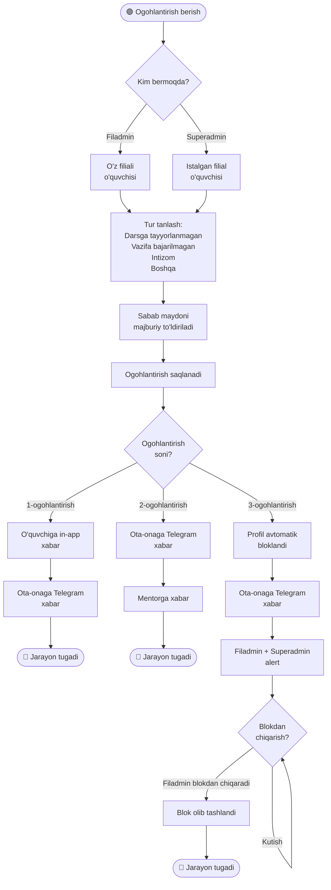
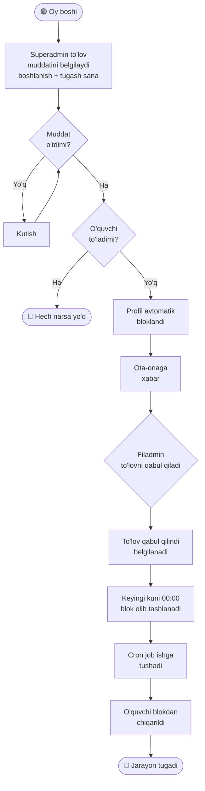
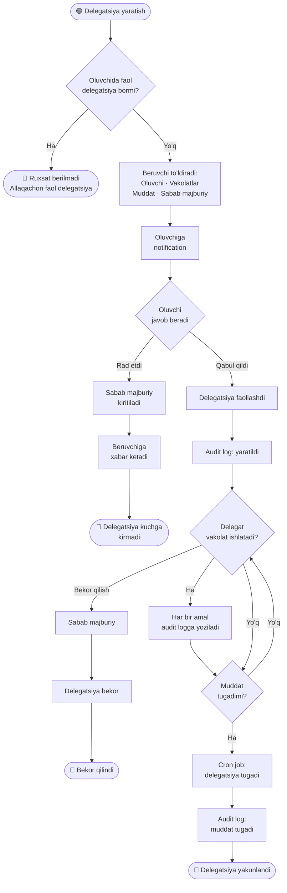
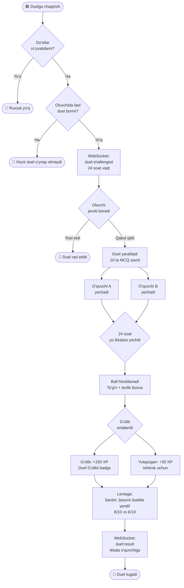
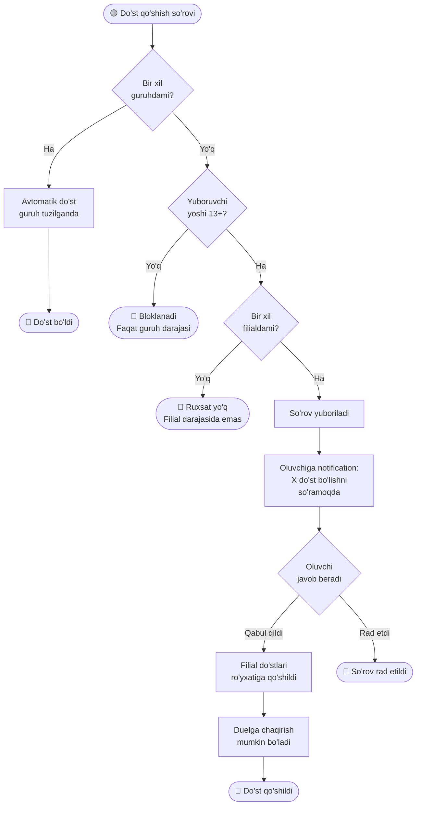
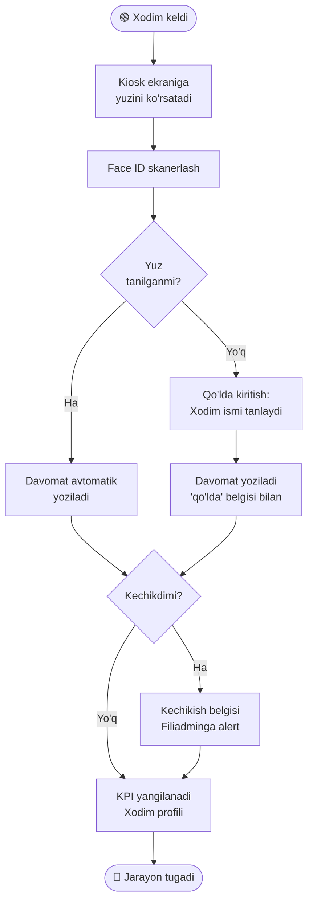
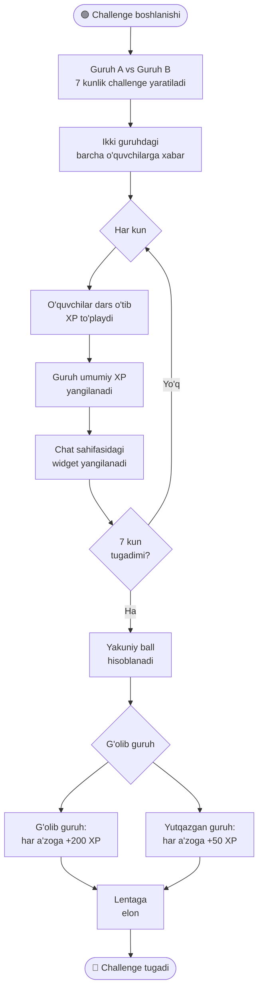
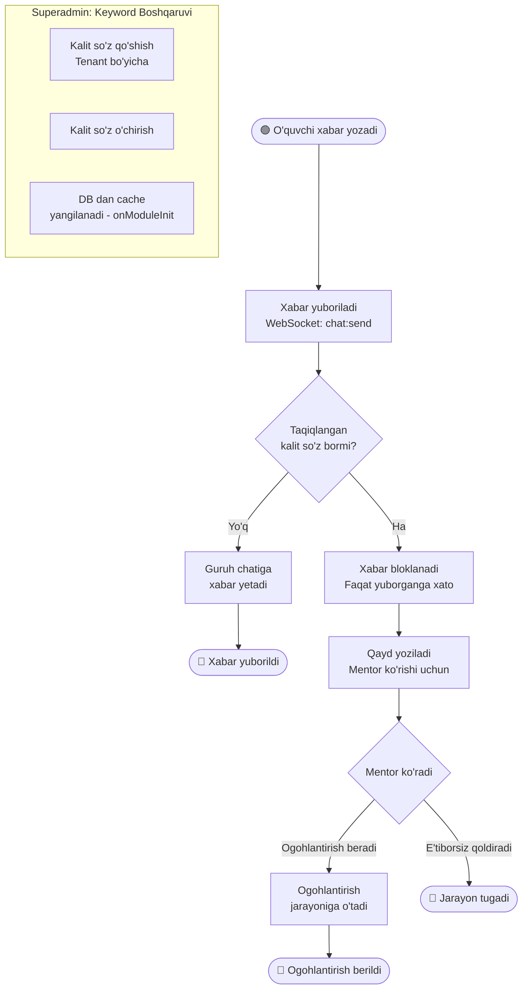
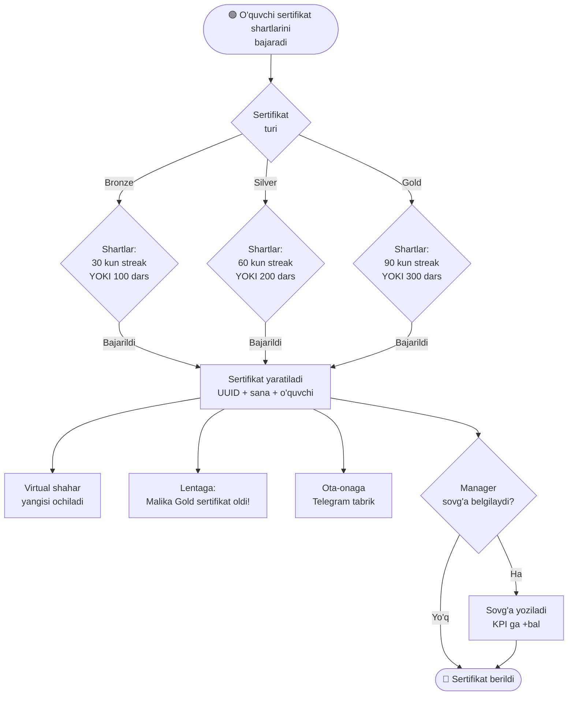

# A'lochi Platform — Use Case BPMN Diagrammalari

> **Notation:** 🟢 Start event | 🔴 End event | ◆ Gateway (XOR) | ◆◆ Parallel gateway | [ ] Task | (( )) Subprocess

---

## 1. O'quvchi Dars Bajarish

```mermaid
flowchart TD
    START([🟢 O'quvchi kirdi]) --> CHECK_BLOCK{O'quvchi\nbloklanganmi?}
    CHECK_BLOCK -- Ha --> BLOCKED([🔴 Kirish rad etildi\nBloklangan xabar])
    CHECK_BLOCK -- Yo'q --> CHECK_PAY{To'lov\nmuddati o'tdimi?}
    CHECK_PAY -- Ha --> AUTO_BLOCK([🔴 Avtomatik bloklash])
    CHECK_PAY -- Yo'q --> LOAD_LESSON[Dars yuklanadi]

    LOAD_LESSON --> WATCH_VIDEO[Video ko'rish\nTezlashtirish mumkin emas]
    WATCH_VIDEO --> VIDEO_DONE{Video\ntugadimi?}
    VIDEO_DONE -- Yo'q --> WATCH_VIDEO
    VIDEO_DONE -- Ha --> CHECK_MCQ{MCQ test\nyoqilganmi?}

    CHECK_MCQ -- Ha --> DO_MCQ[MCQ Test\n10 savol]
    CHECK_MCQ -- Yo'q --> CHECK_SORT{So'z tartib\nyoqilganmi?}
    DO_MCQ --> CHECK_SORT

    CHECK_SORT -- Ha --> DO_SORT[So'zlarni tartibga\nsol]
    CHECK_SORT -- Yo'q --> CHECK_VOCAB{Lug'at\nyoqilganmi?}
    DO_SORT --> CHECK_VOCAB

    CHECK_VOCAB -- Ha --> DO_VOCAB[Lug'at topshirish\nOg'zaki]
    CHECK_VOCAB -- Yo'q --> CHECK_AI{AI Tutor\nyoqilganmi?}
    DO_VOCAB --> CHECK_AI

    CHECK_AI -- Ha --> DO_AI[AI Tutor\nSavol-Javob]
    CHECK_AI -- Yo'q --> CHECK_CAM{Kamera\nyoqilganmi?}
    DO_AI --> CHECK_CAM

    CHECK_CAM -- Ha --> CAMERA[Kamera orqali\ntopshirish]
    CHECK_CAM -- Yo'q --> CALC_XP[XP hisoblanadi\n+N×10 XP]
    CAMERA --> CALC_XP

    CALC_XP --> UPDATE_STREAK[Streak yangilanadi]
    UPDATE_STREAK --> FEED_EVENT[Lentaga voqea\nyoziladi]
    FEED_EVENT --> CHECK_CERT{Sertifikat\nshartlari bajarilganmi?}
    CHECK_CERT -- Ha --> ISSUE_CERT[Sertifikat beriladi]
    CHECK_CERT -- Yo'q --> NEXT_LESSON{Keyingi dars\nbormi?}
    ISSUE_CERT --> NEXT_LESSON
    NEXT_LESSON -- Ha --> UNLOCK[Keyingi dars ochiladi]
    NEXT_LESSON -- Yo'q --> COURSE_DONE([🔴 Kurs tugadi])
    UNLOCK --> END_LESSON([🔴 Dars tugadi])
```

---

## 2. Ogohlantirish va Bloklash Tizimi

---

## 3. To'lov Jarayoni

---

## 4. Delegatsiya Jarayoni

---

## 5. 1v1 Duel Jarayoni

---

## 6. Do'stlik So'rovi (13+ Yosh Tekshiruvi)

---

## 7. Xodim Davomat (Face ID)

---

## 8. Guruh Challenge (7 Kunlik)

---

## 9. Keyword Moderatsiya (Chat)

---

## 10. Sertifikat Berish

